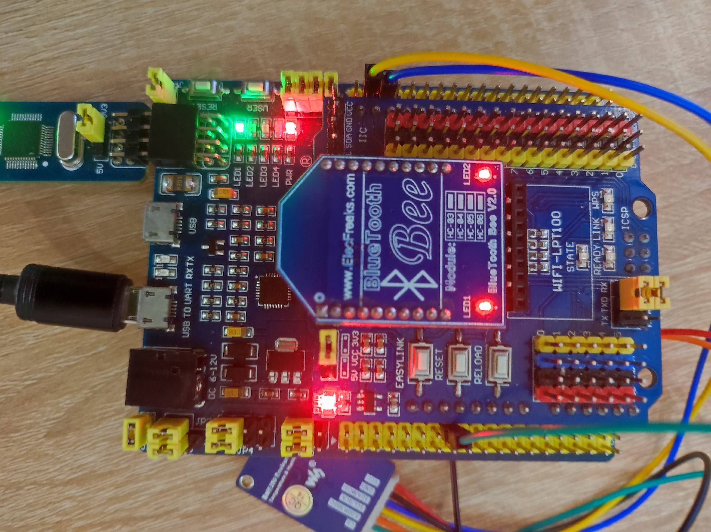
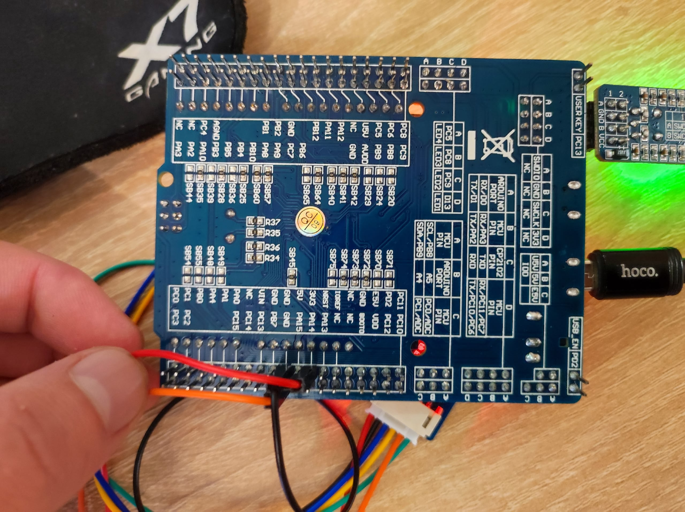

:imagesdir: .
:toc: macro
:toc-title: Оглавление
:icons: font
:figure-caption: Рисунок
:table-caption: Таблица
:stem: latexmath
:source-highlighter: highlight.js
:doctype: book
:eqnums:
:equation-caption: формула
include::titleaPZ.adoc[]
include::analiz.adoc[]
include::arhitectura (2).adoc[]

== Пример работы
Перед началом работы необходимо правильно подключить все компоненты в плате.

.Внешний вид устройства

.Внешний вид устройства

После подачи питания на плату XNUCLEO-F411RE происходит автоматическая инициализация всех компонентов системы: датчика BME280, Bluetooth-модуля HC-06 и задач FreeRTOS.

В терминале смартфона (приложение Bluetooth Terminal) данные отображаются в следующем формате:

.Демонстрация работы передачи данных по Bluetoohs
video::video.mp4[]

== Заключение

В ходе выполнения курсовой работы разработана метеостанция на базе отладочной платы XNUCLEO-F411RE с передачей параметров по Bluetooth.

**Основные результаты работы:**

1. Проведён анализ требований к разработке, определён перечень необходимых аппаратных компонентов.
2. Разработана архитектура программного обеспечения, представленная в виде диаграмм UML.
3. Реализован программный код на языке C++ с использованием FreeRTOS и объектно-ориентированного подхода.
4. Выполнена интеграция датчика BME280 по интерфейсу I2C.
5. Реализована передача данных через Bluetooth-модуль HC-06.

Устройство позволяет измерять атмосферное давление, относительную влажность и температуру воздуха, а также передачей всех параметров на смартфон или компьютер по беспроводному интерфейсу Bluetooth.

P.S. 
Пожалуйста давайте закончим эти мучения