:imagesdir: .
:toc: macro
:toc-title: Оглавление
:icons: font
:figure-caption: Рисунок
:table-caption: Таблица
:stem: latexmath
:source-highlighter: highlight.js
:doctype: book
:eqnums:
:equation-caption: формула

== Описание архитектуры

.Текущая архитектура (как есть, по полному коду)
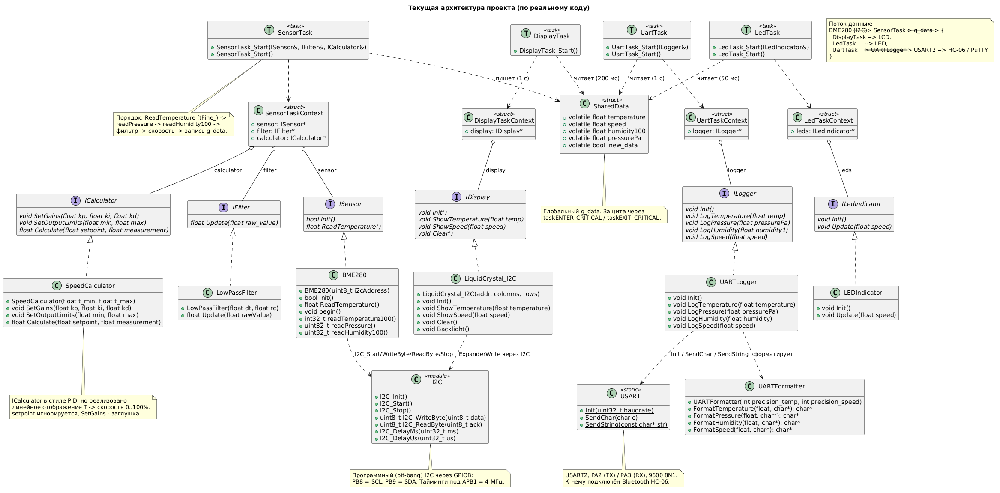

**Рисунок – Текущая архитектура (как есть, по полному коду)**  

Диаграмма показывает полную структуру программного обеспечения и связи между всеми компонентами.

Программное обеспечение построено на архитектуре, основанной на взаимодействии задач, интерфейсов и классов. Основной поток выполнения обеспечивается четырьмя задачами FreeRTOS: `SensorTask`, `DisplayTask`, `LedTask` и `UartTask`.

*Интерфейсы:*

* **ISensor** – определяет методы для работы с датчиком. Реализуется классом `BME280`.
* **IFilter** – определяет метод фильтрации данных. Реализуется классом `LowPassFilter`.
* **ICalculator** – определяет методы для расчёта выходного значения. Реализуется классом `SpeedCalculator`.
* **IDisplay** – определяет методы для отображения данных на дисплее. Реализуется классом `LiquidCrystal_I2C`.
* **ILedIndicator** – определяет методы для управления светодиодной индикацией. Реализуется классом `LEDIndicator`.
* **ILogger** – определяет методы для логирования данных. Реализуется классом `UARTLogger`.

*Классы-драйверы:*

* **BME280** – драйвер датчика BME280, реализует интерфейс `ISensor`. Использует модуль `I2C` для обмена данными.
* **LowPassFilter** – фильтр, реализует интерфейс `IFilter`.
* **SpeedCalculator** – калькулятор скорости, реализует интерфейс `ICalculator`.
* **LiquidCrystal_I2C** – драйвер LCD-дисплея, реализует интерфейс `IDisplay`. Использует модуль `I2C`.
* **LEDIndicator** – драйвер светодиодной индикации, реализует интерфейс `ILedIndicator`.
* **UARTLogger** – логгер, реализует интерфейс `ILogger`. Использует `UARTFormatter` для форматирования и `USART` для отправки.

*Задачи FreeRTOS:*

* **SensorTask** – задача чтения данных с датчика (период 1000 мс). Использует `ISensor`, `IFilter` и `ICalculator`. Записывает данные в `SharedData`.
* **DisplayTask** – задача отображения данных на LCD (период 200 мс). Использует `IDisplay`. Читает данные из `SharedData`.
* **LedTask** – задача управления светодиодной индикацией (период 50 мс). Использует `ILedIndicator`. Читает `speed` из `SharedData`.
* **UartTask** – задача передачи данных через UART (период 1000 мс). Использует `ILogger`. Читает данные из `SharedData`.

*Структура данных:*

* **SharedData** – глобальная структура для обмена данными между задачами. Содержит поля `temperature`, `speed`, `humidity100`, `pressurePa` и `new_data`.

*Поток данных и инициализация:*

Данные от датчика BME280 передаются по шине I2C в задачу `SensorTask`, которая обрабатывает их и записывает в `SharedData`. Затем:
- `DisplayTask` читает данные и выводит их на LCD (`LiquidCrystal_I2C`).
- `LedTask` читает скорость и управляет светодиодами (`LEDIndicator`).
- `UartTask` читает данные и отправляет их через UART (`UARTLogger` → `USART2` → HC-06).

В `main()` после настройки системы (`SystemClock_Config`, `USART::Init(9600)`, `I2C_Init`) запускаются четыре задачи, после чего вызывается `vTaskStartScheduler`.

=== Диаграмма интерфейсов

.Диаграмма интерфейсов
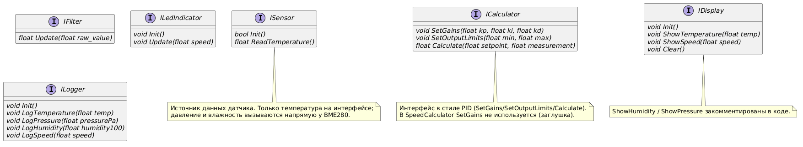

 
На диаграмме показаны все основные интерфейсы системы.

*   `ISensor` – определяет базовые методы для работы с датчиком. Реализуется классом `BME280`.
*   `IFilter` – определяет метод фильтрации данных. Реализуется классом `LowPassFilter`.
*   `ICalculator` – определяет методы для расчёта выходного значения. Реализуется классом `SpeedCalculator`.
*   `IDisplay` – определяет методы для отображения данных на дисплее. Реализуется классом `LiquidCrystal_I2C`.
*   `ILedIndicator` – определяет методы для управления светодиодной индикацией. Реализуется классом `LEDIndicator`.
*   `ILogger` – определяет методы для логирования данных. Реализуется классом `UARTLogger`.

=== Диаграмма класса BME280

.Класс BME280
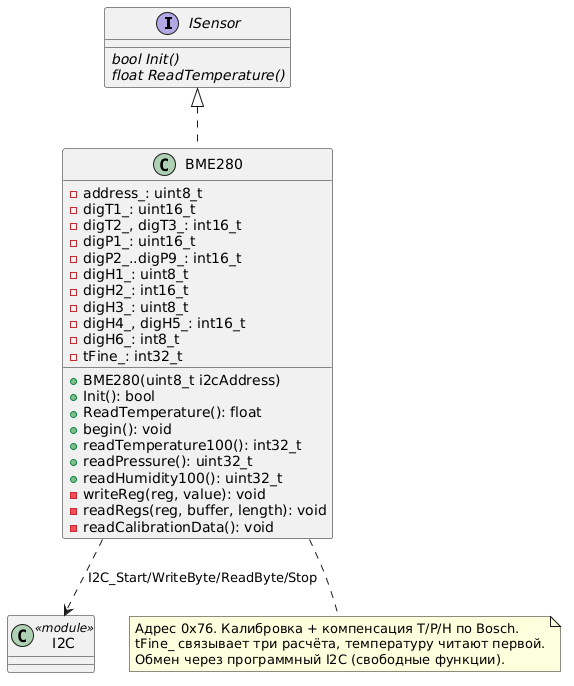

  
Класс `BME280` является драйвером датчика BME280 и реализует интерфейс `ISensor`.

*   Поле `address_` – адрес датчика на шине I2C.
*   Поля `digT1_`, `digT2_`, `digT3_` – калибровочные коэффициенты температуры.
*   Поля `digP1_`…`digP9_` – калибровочные коэффициенты давления.
*   Поля `digH1_`…`digH6_` – калибровочные коэффициенты влажности.
*   Поле `tFine_` – промежуточное значение для компенсации.
*   Метод `Init()` – инициализация датчика.
*   Метод `ReadTemperature()` – чтение температуры.
*   Метод `readTemperature100()` – чтение температуры в сотых долях.
*   Метод `readPressure()` – чтение давления.
*   Метод `readHumidity100()` – чтение влажности в сотых долях.

=== Диаграмма класса LowPassFilter

.Класс LowPassFilter
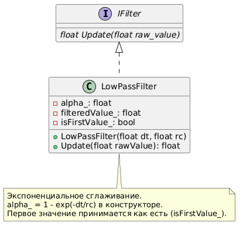
  
Класс `LowPassFilter` реализует интерфейс `IFilter` и выполняет экспоненциальное сглаживание данных.

*   Поле `alpha_` – коэффициент сглаживания.
*   Поле `filteredValue_` – отфильтрованное значение.
*   Поле `isFirstValue_` – флаг первого значения.
*   Метод `LowPassFilter(float dt, float rc)` – конструктор, рассчитывает коэффициент сглаживания.
*   Метод `Update(float rawValue)` – фильтрация входного значения.

=== Диаграмма класса SpeedCalculator

.Класс SpeedCalculator
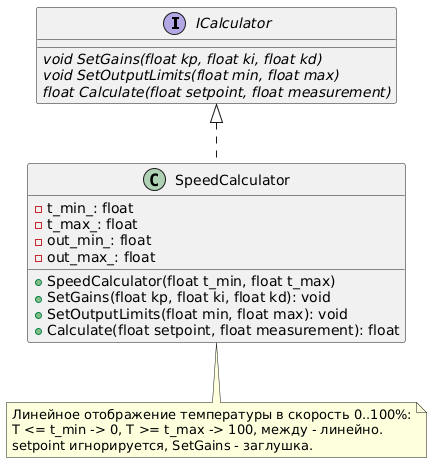

 
Класс `SpeedCalculator` реализует интерфейс `ICalculator` и вычисляет скорость на основе температуры.

*   Поле `t_min_` – минимальная температура.
*   Поле `t_max_` – максимальная температура.
*   Поле `out_min_` – минимальное выходное значение.
*   Поле `out_max_` – максимальное выходное значение.
*   Метод `SpeedCalculator(float t_min, float t_max)` – конструктор.
*   Метод `SetGains(float kp, float ki, float kd)` – установка коэффициентов (заглушка).
*   Метод `SetOutputLimits(float min, float max)` – установка ограничений выхода.
*   Метод `Calculate(float setpoint, float measurement)` – расчёт скорости.

=== Диаграмма класса UARTLogger

.Класс UARTLogger
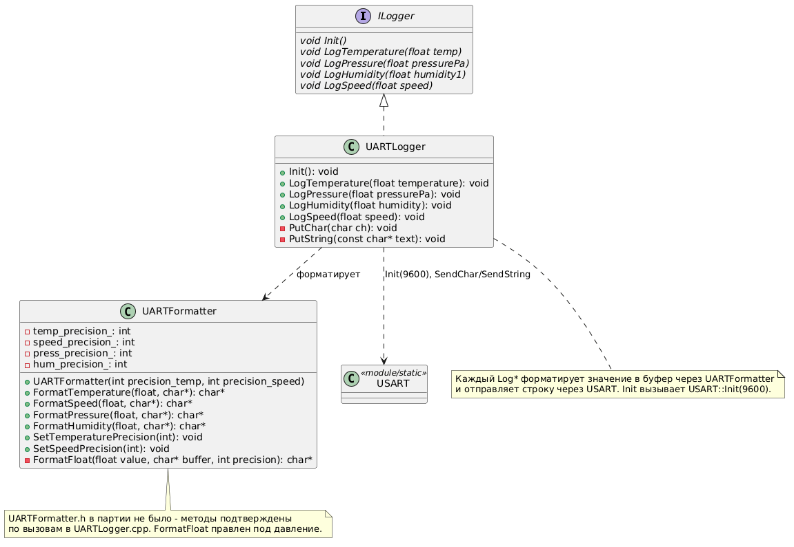

Класс `UARTLogger` реализует интерфейс `ILogger` и отвечает за отправку данных через UART.

*   Метод `Init()` – инициализация.
*   Метод `LogTemperature()` – отправка температуры.
*   Метод `LogPressure()` – отправка давления.
*   Метод `LogHumidity()` – отправка влажности.
*   Метод `LogSpeed()` – отправка скорости.
*   Метод `PutChar()` – отправка одного символа.
*   Метод `PutString()` – отправка строки.

=== Диаграмма класса USART

.Класс USART
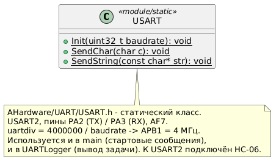

 
Статический класс `USART` предоставляет методы для работы с USART2.

*   Метод `Init(uint32_t baudrate)` – инициализация USART2 с заданной скоростью.
*   Метод `SendChar(char c)` – отправка одного символа.
*   Метод `SendString(const char* str)` – отправка строки.

.Класс UartTask
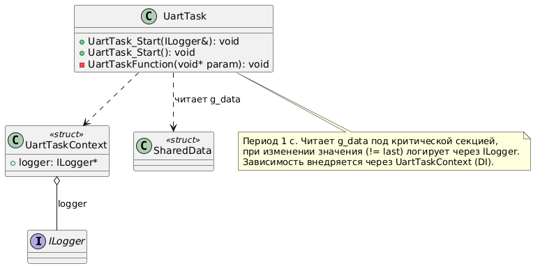

 
Задача `UartTask` отвечает за передачу данных через UART (Bluetooth) с периодом 1000 мс.

*   Использует интерфейс `ILogger` (реализуемый классом `UARTLogger`) для отправки данных.
*   Читает данные из глобальной структуры `SharedData` под критической секцией.
*   При изменении значения (если новое значение не равно последнему отправленному) вызывает соответствующий метод логгера.
*   Зависимость от логгера внедряется через структуру `UartTaskContext`.

=== Диаграмма класса DisplayTask

.Класс DisplayTask
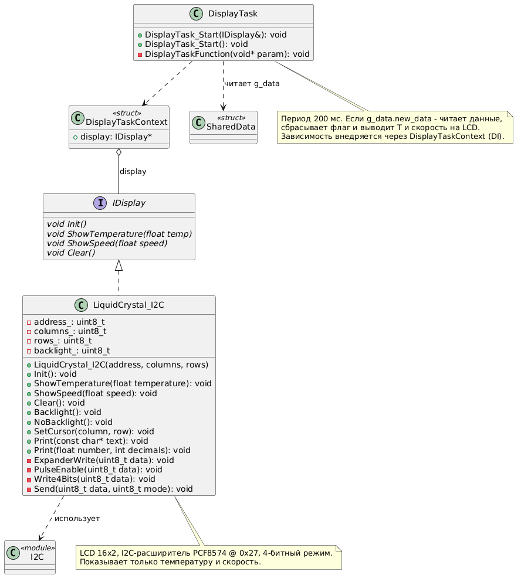

Задача `DisplayTask` отвечает за отображение данных на LCD-дисплее с периодом 200 мс.

*   Использует интерфейс `IDisplay` (реализуемый классом `LiquidCrystal_I2C`) для вывода данных.
*   Читает данные из глобальной структуры `SharedData`.
*   Если флаг `new_data` установлен, задача сбрасывает его и выводит температуру и скорость на дисплей.
*   Зависимость от дисплея внедряется через структуру `DisplayTaskContext`.

**Класс LiquidCrystal_I2C** – драйвер LCD-дисплея 16x2 на базе I2C-расширителя PCF8574 (адрес 0x27, 4-битный режим). Реализует интерфейс `IDisplay`. Использует модуль `I2C` для обмена данными.

*   Поля: `address_`, `columns_`, `rows_`, `backlight_`.
*   Методы: `Init()`, `ShowTemperature()`, `ShowSpeed()`, `Clear()`, `Backlight()`, `NoBacklight()`, `SetCursor()`, `Print()`, `ExpanderWrite()`, `PulseEnable()`, `Write4Bits()`, `Send()`.

=== Диаграмма класса LedTask

.Класс LedTask
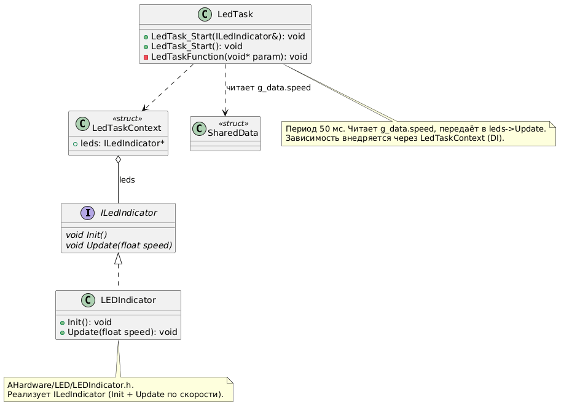
 
Задача `LedTask` отвечает за управление светодиодной индикацией с периодом 50 мс.

*   Использует интерфейс `ILedIndicator` (реализуемый классом `LEDIndicator`).
*   Читает значение `speed` из глобальной структуры `SharedData`.
*   Передаёт скорость в метод `Update()` светодиодного индикатора.
*   Зависимость от индикатора внедряется через структуру `LedTaskContext`.

**Класс LEDIndicator** – реализует интерфейс `ILedIndicator`. Управляет светодиодной индикацией в зависимости от скорости.

*   Методы: `Init()`, `Update(float speed)`.

=== Диаграмма класса SensorTask

.Класс SensorTask
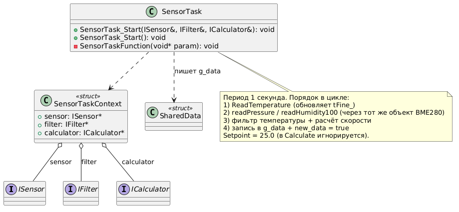

 
Задача `SensorTask` отвечает за чтение данных с датчика BME280 и их обработку с периодом 1000 мс.

*   Метод `SensorTask_Start()` – запуск задачи.
*   Метод `SensorTaskFunction()` – функция задачи.

=== Диаграмма структуры SharedData

.Структура SharedData
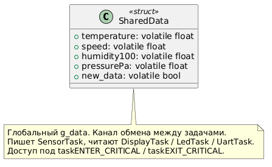

  
Структура `SharedData` является глобальным каналом обмена данными между задачами.

*   Поле `temperature` – температура.
*   Поле `speed` – скорость.
*   Поле `humidity100` – влажность (в сотых долях процента).
*   Поле `pressurePa` – давление (в Па).
*   Поле `new_data` – флаг наличия новых данных.

=== Диаграмма класса I2C

.Класс I2C
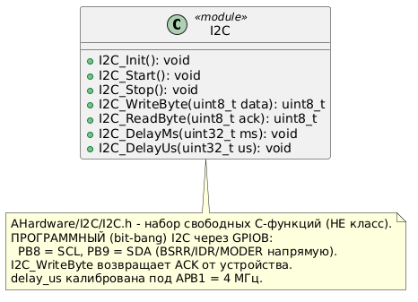

  
Класс `I2C` реализует интерфейс `II2C` для работы с шиной I2C.

.Общая диаграмма архитектуры
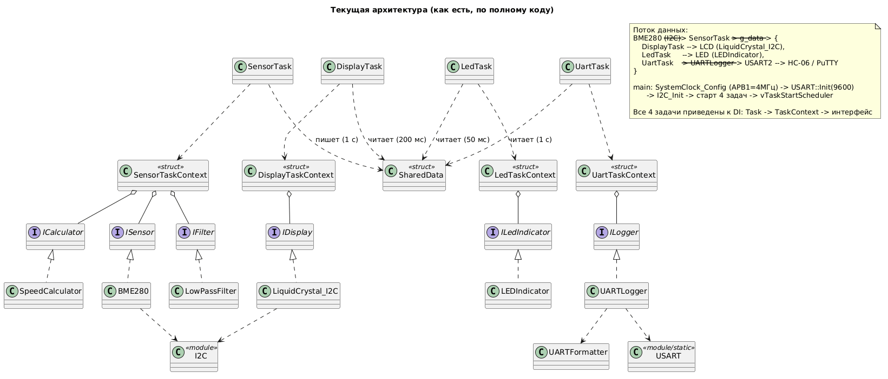

 
Общая диаграмма, показывающая все компоненты и их связи.