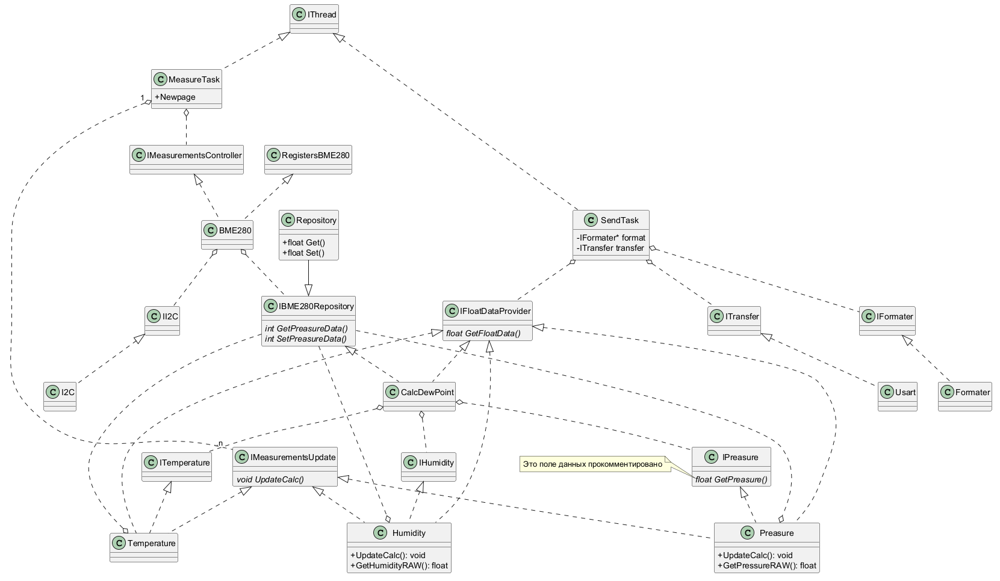
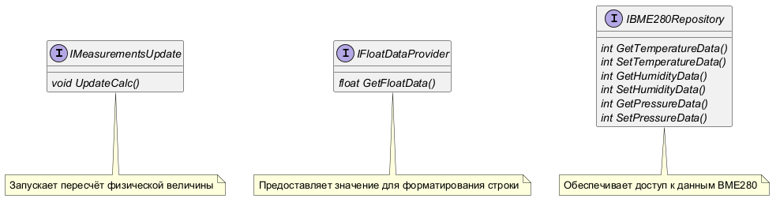
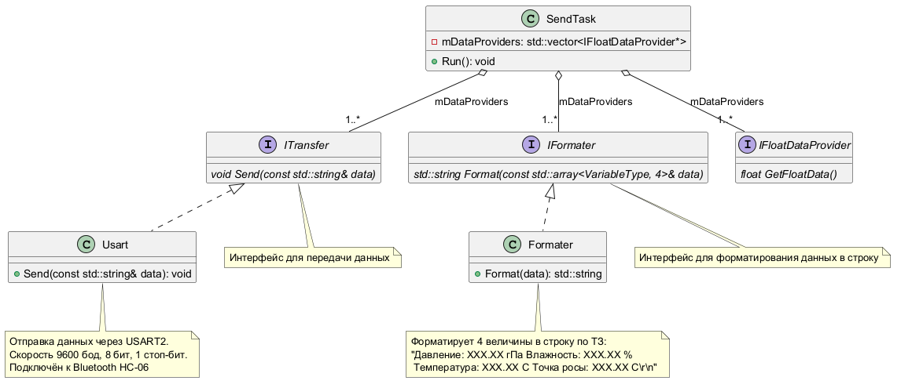
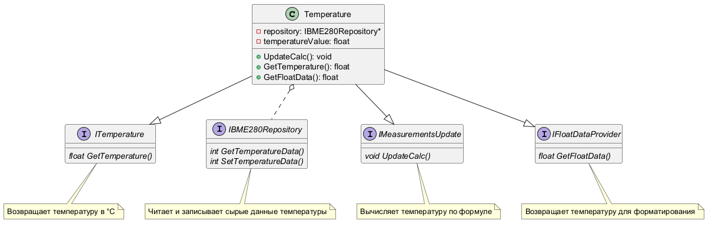
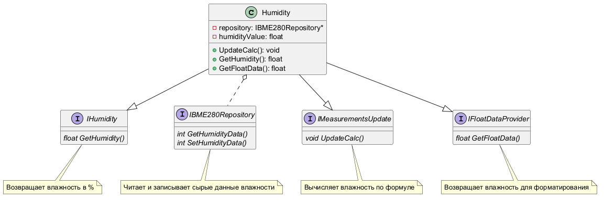
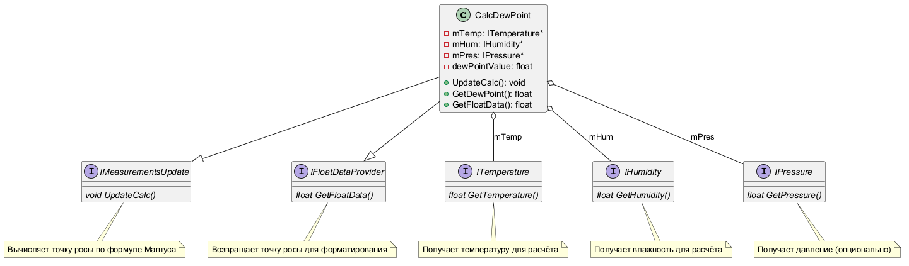
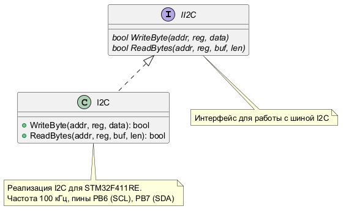
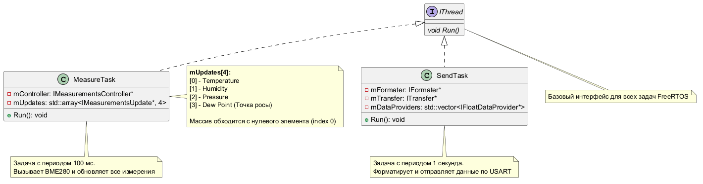
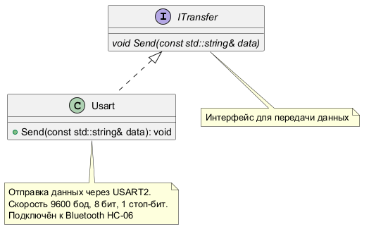

:imagesdir: .
:toc: macro
:toc-title: Оглавление
:icons: font
:figure-caption: Рисунок
:table-caption: Таблица
:stem: latexmath
:source-highlighter: highlight.js
:doctype: book
:eqnums:
:equation-caption: формула

include::titlearh.adoc[]

.Архитектура ПО с элементами дизайна

Описание архитектуры:

SendTask наследует интерфейс IThread и отвечает за отправку данных. Он содержит интерфейсы IFormater для форматирования данных и ITransfer для передачи данных через USART, а также IFloatDataProvider для получения данных о температуре, влажности, давлении и точки росы.

Formater наследует интерфейс IFormater и отвечает за форматирование данных. Он использует интерфейс IFloatDataProvider для получения данных о температуре, влажности, давлении и точки росы, а также для их форматирования в строку.

Usart наследует интерфейс ITransfer и отвечает за передачу данных через USART.

MeasureTask наследует интерфейс IThread и отвечает за измерения данных. Он содержит интерфейсы IMeasurementsUpdate и IMeasurmentsController 

BME280 наследует интерфейсы IMeasurmentsController и RegistersBME280 и содержит интерфейсы II2C и IBME280Repository.
I2C наследует интерфейс II2C.

Preasure наследует интерфейсы IMeasurementsUpdate, IFloatDataProvider, IBME280Repository, IPreasure.

Temperature наследует интерфейсы IMeasurementsUpdate, IFloatDataProvider, IBME280Repository, ITemperature.

Humidity наследует интерфейсы IMeasurementsUpdate, IFloatDataProvider, IBME280Repository, IHumidity.

CalcDewPoint наследует интерфейсы IMeasurementsUpdate, IFloatDataProvider, IBME280Repository.

MeasureTask получает через IMeasurmentsController сырые коды от регистров, которые отвечают за давление, температуру и влажность. Коды в свою очередь берутся из регистров, информация о которых хранится в RegistersBME280, через интерфейс II2C и класс I2C. Затем MeasureTask передаёт полученные данные через IMeasurementsUpdate в классы Humidity, Temperature и Preasure соответствующие значения регистров.
 Затем полученные данные через интерфейсы ITemperature, IHumidity и IPreasure передаются в CalcDewPoint. Так как ему для вычисления нужны только эти данные и никакие другие.
Затем когда все 4 параметра будут вычисленны они через интерфейс IFloatDataProvider передаются в SendTask, там эти данные преобразуются в строку. Эта строка затем передаётся через Usart.
IBME280Repository говорит Humidity, Temperature и Preasure о том, что пора посчитаться.

Код SendTask 
----
struct variableType
{
  std::string name;
  float value;
  std::string unit;
};

void Run()
{
  std::array<variableType, dataProviderArray.size()> dataArray = {};
  for(auto it = dataProviderArray.begin(); it != dataProviderArray.end(); ++it)
  {
    auto data = it->Get();
    dataArray.push_back(data);
  }
  std::string resultString = formeter->Format(dataArray);
  transfer->Send(resultString);
}
----

В качестве дизайна представлены рисунки далее:

.Общая картина интерфейсов

**Рисунок – Общие интерфейсы**  
На диаграмме показаны три ключевых интерфейса:  

*   `IMeasurementsUpdate` – содержит метод `UpdateCalc()`, отвечающий за пересчёт сырых регистровых значений в физические величины. Реализуется классами `Temperature`, `Humidity`, `Pressure`, `CalcDewPoint`.  

*   `IFloatDataProvider` – предоставляет метод `GetFloatData()`, посредством которого задача `SendTask` получает уже вычисленное значение.  

*   `IBME280Repository` – интерфейс доступа к данным датчика BME280. Включает методы чтения и записи сырых целочисленных значений температуры, влажности и давления. Реализуется классом `Repository`.

.Класс SendTask

**Рисунок – Класс `SendTask`**  
`SendTask` является одной из двух задач FreeRTOS (наследует `IThread`).  

*   Поле `mDataProviders` – вектор указателей на интерфейс `IFloatDataProvider`. Агрегация (пустой ромб) означает, что задача хранит ссылки на объекты-поставщики.  

*   Вектор включает четыре реализации: `Temperature`, `Humidity`, `Pressure`, `CalcDewPoint`. Порядок элементов определяет последовательность данных в выходной строке.  

*   Метод `Run()` перебирает все элементы вектора, вызывает `GetFloatData()`, затем через `IFormater` и `ITransfer` формирует и отправляет строку.

.Класс Temperature

**Рисунок – Класс `Temperature`**  
Класс представляет физическую величину «температура».  

*   Реализует три интерфейса:  
    - `ITemperature` – специфический интерфейс для температуры (метод `GetTemperature()`).  
    - `IFloatDataProvider` – возвращает температуру для отправки.  
    - `IMeasurementsUpdate` – метод `UpdateCalc()` пересчитывает сырую температуру из репозитория в градусы Цельсия.  

*   Поле `repository` (агрегация, пустой ромб) – указатель на `IBME280Repository`, откуда берутся сырые целочисленные данные.  

*   Поле `temperatureValue` хранит вычисленное значение.  

.Класс Pressure

**Рисунок – Класс `Pressure`**  
Аналогичен классу температуры, но для атмосферного давления.  

*   Реализует интерфейсы: `IPressure` (метод `GetPressure()`), `IFloatDataProvider`, `IMeasurementsUpdate`.  

*   Через агрегацию на `IBME280Repository` получает сырое значение давления, преобразует в гПа и сохраняет в `pressureValue`.  

*   Метод `UpdateCalc()` вызывается задачей `MeasureTask` после каждого измерения.

.Класс Humidity

**Рисунок – Класс `Humidity`**  
Аналогично – для относительной влажности.  

*   Реализует `IHumidity`, `IFloatDataProvider`, `IMeasurementsUpdate`.  

*   Использует `IBME280Repository` для получения сырых данных влажности, пересчитывает в проценты.

.Класс CalcDewPoint

**Рисунок – Класс `CalcDewPoint`**  
Класс вычисляет точку росы (расчётная величина, не измеряемая датчиком напрямую).  

*   Реализует `IMeasurementsUpdate` (метод `UpdateCalc()`) и `IFloatDataProvider`.  

*   В отличие от предыдущих, не зависит от `IBME280Repository`, а агрегирует (простая ассоциация) интерфейсы `ITemperature`, `IHumidity`, `IPressure` – через них получает уже вычисленные значения температуры, влажности и давления.  

*   Расчёт ведётся по формуле Магнуса внутри `UpdateCalc()`, результат сохраняется в `dewPointValue`.

.Интерфейс и класс I2C

**Рисунок – Интерфейс `II2C` и его реализация `I2C`**  

*   `II2C` – абстрактный интерфейс для работы с шиной I2C. Содержит методы записи одного байта в регистр и чтения нескольких байт из регистра.  

*   Класс `I2C` реализует эти методы для микроконтроллера STM32F411RE (пины PB6 – SCL, PB7 – SDA, частота 100 кГц).  

*   Используется драйвером BME280 для обмена данными.

.Интерфейс IThread

**Рисунок – Интерфейс `IThread` и классы задач**  

*   `IThread` – базовый интерфейс всех задач FreeRTOS, объявляет метод `Run()`.  

*   `MeasureTask` – задача с периодом 100 мс. Имеет указатели на контроллер BME280 (`IMeasurementsController`) и на обновляемые величины (`IMeasurementsUpdate` для температуры, влажности, давления, точки росы). В методе `Run()` запускает измерение через BME280, а затем вызывает `UpdateCalc()` для каждой величины.  

*   `SendTask` – задача с периодом 1 с (описана выше).  

*   Обе задачи наследуют `IThread`.

.Интерфейс ITransfer

**Рисунок – Интерфейс `ITransfer` и класс `Usart`**  

*   `ITransfer` – интерфейс для передачи данных, содержит метод `Send(const std::string&)`.  

*   `Usart` – конкретная реализация для аппаратного USART2 (скорость 9600 бод, 8 бит, 1 стоп-бит). Подключён к Bluetooth-модулю HC-06.  

*   Используется задачей `SendTask` для отправки форматированной строки.