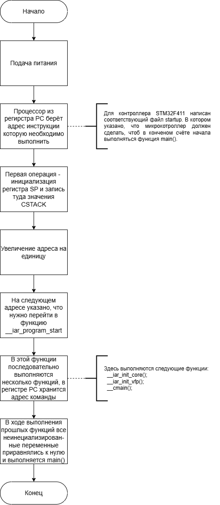

:toc: macro
:toc-title: Оглавление
:figure-caption: Рисунок

include::Title.adoc[]

toc::[]

== Превращение текста в машинные коды

. Текст, написанный программистом превращается в машинный код за счёт работы компилятора, который проверяет текст на соответствие синтаксису языка С++. Семантический анализатор разбивает код на токены языка, то есть разбирает операнды, выражения и т.д.
. После того, как компилятор закончит работу, прежде чем программа будет сформирована, необходимо распределить выделенный пул адресов регистров. Этим занимается линкёр. Он в соответствии со специальным файлом "говорит" где начинаются и кончаются области памяти, такие как ПЗУ и ОЗУ, где хранятся переменные и операции.
. На выходе линкёра двоичный файл с расширением .elf, который прошивается в микроконтроллер и запускается на его мощностях.

[.text-left]
== Запуск программного обеспечения

. После подачи питания на микроконтроллер происходит инициализация стека. Стек это память. Размер этой памяти можно задать в настройках проекта. Обычно размер стека задаётся в пределах от 1 КБ до 4 КБ. Стек работает по принципу LIFO (Last In First Out), то есть последний зашедший элемент будет первым извлечённым из стека. Весь текущий контекст, необходимый в данной функции, а именно: локальные переменные функций, параметры функций, адреса возврата из функций и т.д. хранятся в стеке.  
. Есть несколько регистров, которые отвечают за работу со стеком и управлением программой в целом:
.. Регистр указателя на стек R13/SP, указывает на последний элемент стека. То есть, если стек из 1 КБ, то регистр будет указывать на адрес начала стека + 1024 байта. После добавления чего-либо в стек, регистр будет указывать на адрес начала стека + 1020 байта и т.д. При условии что размер добавляемого элемента 4 байта.
.. Регистр R15/PC - программный счётчик, указывает на адрес текущей операции, выполняемой в стеке.
.. Регистр R14/LR - содержит адресс функции, в которую нужно вернуться, после окончания выполнения команд.

Помимо указанных регистров, существуют другие регистры общего назначения R0-R11, которые используются опционально, в зависимости от выполняемой задачи.

=== Программная реализация запуска функции main()

Далее я опишу каким именно образом микроконтроллер переходит к выполнению функции main(). См. приложения, <<startup_scheme>>.

== Приложения

=== Схема запуска микроконтроллера
[#startup_scheme]
.Схема запуска микроконтроллера

=== Код программы
[#code_from_IAR]
.Код программы на языке С++
image::1.png[]

=== Внешний вид платы
[#plata]
.Внешний вид платы с ядром ARM Cortex-M4
image::2.jpg[]
