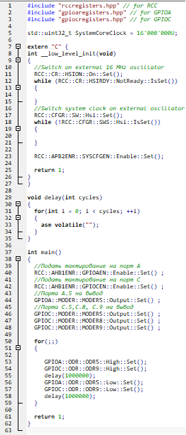
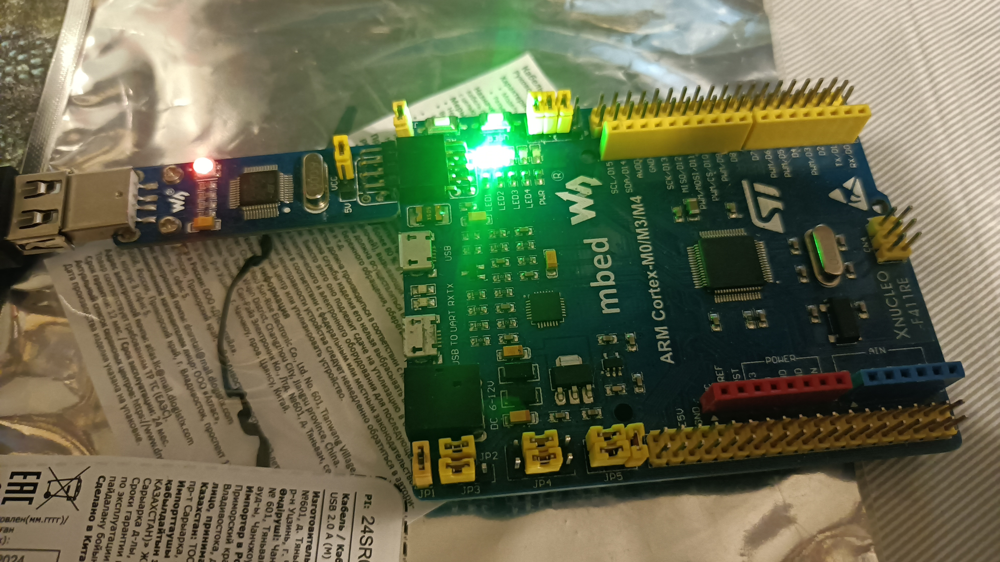

[.text-center]
= МИНИСТЕРСТВО НАУКИ И ВЫСШЕГО ОБРАЗОВАНИЯ РОССИЙСКОЙ ФЕДЕРАЦИИ
Федеральное государственное автономное образовательное учреждение высшего образования
«Южно-Уральский государственный университет» (национальный исследовательский университет) Высшая школа электроники и компьютерных наук Кафедра  «Информационно-измерительная техника»

[.text-center]
Лабораторная работа №2

[cols="30,40,30",frame=none,grid=none]
|===
| Проверил:
  Колодий 
| 
| Студент:
   Серов А.С.
|===
&nbsp;

[.text-center]
Челябинск 2025
[.text-left]

== Превращение текста в машинные коды

. Текст, написанный программистом превращается в машинный код за счёт работы компилятора, который проверяет текст на соответствие синтаксису языка С++. Семантический анализатор разбивает код на токены языка, то есть разбирает операнды, выражения и т.д.
. После того, как компилятор закончит работу, прежде чем программа будет сформирована, необходимо распределить выделенный пул адресов регистров. Этим занимается линкёр. Он в соответствии со специальным файлом "говорит" где начинаются и кончаются области памяти, такие как ПЗУ и ОЗУ, где хранятся переменные и операции.
. На выходе линкёра двоичный файл с расширением .elf, который прошивается в микроконтроллер и запускается на его мощностях.

[.text-left]
== Запуск программного обеспечения

. После подачи питания на микроконтроллер происходит инициализация стека. Стек представляет собой три регистра.
.. Регистр указателя на стек R13/SP, указывает на последний элемент стека.
.. Регистр R15/PC - программный счётчик, указывает на адрес текущей операции, выполняемой в стеке.
.. Регистр R14/LR - содержит адресс функции, в которую нужно вернуться, после окончания выполнения команд.
. Если прерывания используются, то необходимо в таблицу векторов прерываний добавить переходы на адреса обработчиков прерываний
. Далее происходит присвоение неинициализированным переменным нулей.
. После этого следует операция присовения инициализированных переменных указанными в программе значениями
. Когда области памяти определены, а переменные проинициализированны, действием по умолчанию будет являться вызов функции main(). Это происходит за счёт того, что у нас есть файл, который запускается при подаче питания. В этом файле написана программистом функция __iar_program_start(). Которая в свою очередь вызывает функцию _cmain(). Которая вызывает функцию _low_level_init(). Благодаря которой в конечном счёте вызывается функция main(). 

== Пример кода из среды разработки IAR

== Внешний вид платы

