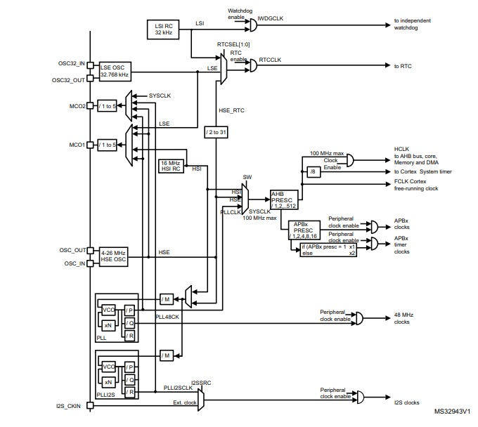
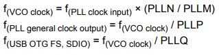
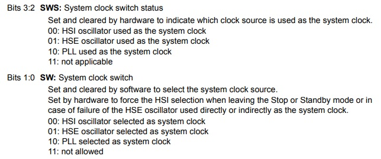

:toc: macro
:toc-title: 
:figure-caption: 
:source-highlighter: 
:figure-caption: Рисунок

include::Title.adoc[]

toc::[]

== Цель работы
1. Разобраться почему не работает кнопка.
2. Вместо системного таймера подключить таймер TIM2.
3. Изучить и описать как реализовать настройку системы тактирования микроконтроллера STM32F411RE на внешний и внутренний источник тактирования PLL.
4. Добавить про порты ввода-вывода (GPIO) для управления периферией их настройку, как они работают и зачем нужны.
5. Не отчислиться (опционально).

== Почему не работала кнопка?
Кнопка не работала, потому что студент, который расшаривал экран нажимал на кнопку reset, а не UserButton.

=== Инициализация

В функции "__low_level_init()" добавлена одна строчка:
[source,c++]
----
RCC::APB1ENR::TIM2EN::Enable::Set();  // Включение тактирования таймера TIM2
----
В микроконтроллерах STM32 для экономии энергии все периферийные модули по умолчанию отключены. Эта команда "включает питание" для таймера TIM2, позволяя ему работать. Без этой строки любые попытки работы с TIM2 приведут к ошибке.

=== Описание частот МК

. Настройка частоты: При SystemCoreClock = 32 МГц, предделитель 31999 делит частоту до 1000 Гц (1 кГц). Это значит, что таймер делает один "тик" каждую миллисекунду. На рисунке 1 показана структурная схема задатчика частоты на микроконтроллере. См. рис. 1 <<clocktree>>
. Расчет времени: Если мы хотим задержку 500 мс, то в регистр ARR записываем 499. Таймер будет считать от 0 до 499, что займет 500 тиков × 1 мс = 500 мс.

. Механизм ожидания: Программа входит в цикл while и ждет, пока таймер не установит флаг. Как только таймер досчитывает до заданного значения, флаг устанавливается, и программа продолжает работу.

. Режим однократного запуска: После каждой задержки таймер выключается (CEN::Disable). Это позволяет точно контролировать каждый временной интервал.

== Тактирование

В микроконтроллере STM32F411RE система тактирования может использовать внутренний (HSI) или внешний (HSE) источник частоты, а также умножать её через PLL. Вообще есть еще LSI и LSE, но это уже совсем другая история.

[#clocktree]
.Дерево времени

=== Настройка PLL и подключение HSE

В функции инициализации __low_level_init() была реализована следующая последовательность:

Включение внешнего кварца (HSE) - используется 8 МГц резонатор на плате.
Переключение системы на HSE - выбираем внешний источник как основной.
Настройка PLL - умножаем частоту для получения 32 МГц системной частоты:

Делитель M = 2 (8 МГц / 2 = 4 МГц)

Множитель N = 64 (4 МГц × 64 = 256 МГц)

Делитель P = 8 (256 МГц / 8 = 32 МГц)

Включение PLL и ожидание готовности

Переключение системы на PLL - теперь процессор работает на 32 МГц.

==== формулы для расчетов M,N,P:

[#pll_freq_conf]
.Настройка выходной частоты PLL

=== Системный таймер

SysTick - это 24-битный системный таймер, встроенный в ядро Cortex-M4. На STM32F411 он присутствует всегда и используется для:

. Генерации прерываний с фиксированным интервалом;

. Реализации задержек;

. Измерения времени выполнения кода;

. Основа для операционных систем реального времени (RTOS);

=== Таймер TIM2

. Таймеры 32-битные (то есть могут считать до 2^32), умеют работать: с инкрементальными энкодерами и датчиками Холла,несколько таймеров можно синхронизировать между собой.

. Таймеры можно использовать для: Захвата сигнала, то есть когда меняется из 1 в 0, сравнения, генерации ШИМ, генерация импульса

=== Источники получения частоты в МК

Всего есть несколько источников.

. HSI
. HSE
. LSE
. LSI

Они являются основными, и с их помощью можно подключить PLL.
Три буквы "H" "S" "E" или "H" "S" "I" можно расшифровать как:

.. H - high. Высокая частота;

.. S - speed. Скорость;

.. E - external. Внешний источник;

Таким образом можно расшифровать 1, 2, 3 и 4 источники, просто посмотрев на их название.

=== Настройка основных источников получения частоты МК
Настройка первичных источников тактирования затрагивает 3 основных регистра: 

. RCC_CR; 

. RCC_CFGR;

. RCC_PPLLCFGR.

Включение источника осуществляется через регистр RCC_CR. Для того. чтобы включить, необходимо установить бит в "1". Так же следует отметить, что между командой на включение и фактической готовностью к работе существует задержка. Для этого есть в данном регистре соответствующие биты, RDY. 

|===
||HSE|PLL|HSI
|ON|16|24|0
|RDY|17|25|1
|===

Если мы захотим включить внешний низкоскоростной источник, необходимо подать на бит 0 - "1" и дождаться когда бит 1 установиться в "1". Тогда можно быть уверенным, что данный источник активен и готов к использованию.

Когда источник выбран, можно перейти к переключению системной частоты на этот источник. Для этого необходим регистр RCC_CFGR. Там нам нужны биты с 3 по 0, то есть SWS(3:2) и SW(1:0). См. рис. 3 <<sws_sw>>

. SW(system clock switch) отвечает за выбор источника, управление - программное;

. SWS(System clock switch status) отвечает за подтверждение переключения на нужный источник, управление - аппаратное.

[#sws_sw]
.Настройка системной частоты на источник

Как видно из рисунка 3 <<sws_sw>>, данные биты регистра могут принимать несколько значений:

. SWS
.. 11 - не используется;
.. 10 - подтверждено аппаратное использование PLL;
.. 01 - подтверждено аппаратное использование HSE;
.. 00 - подтверждено аппаратное использование HSI;

. SW
.. 11 - не используется;
.. 10 - выбран PLL;
.. 01 - выбран HSE;
.. 00 - выьран HSI;

Для использования PLL необходимо предварительное взаимодействие с регистром RCC_PPLLCFGR. 

==== Включение и настройка внешнего кварца:

[source,c++]
----
RCC::CR::HSEON::On::Set();
while (RCC::CR::HSERDY::NotReady::IsSet()) {}
----
Включает внешний кварцевый генератор на 8 МГц и ждёт, пока он стабилизируется

[source,c++]
----
RCC::CFGR::SW::Hse::Set();
while (!RCC::CFGR::SWS::Hse::IsSet()) {}
----
Переключает систему на работу от HSE и ждёт подтверждения переключения.

[source,c++]
----
RCC::CR::HSION::Off::Set();
----
Выключает внутренний RC-генератор HSI (16 МГц), чтобы экономить энергию, так как теперь используем внешний кварц.

Для подбора коэффициентов необходимо воспользоваться формулами. См. рис 2. <<pll_freq_conf>>

=== Настройка PLL:

[source,c++]
----
RCC::PLLCFGR::PLLM::Set(2U);     // M = 2 
RCC::PLLCFGR::PLLN::Set(64U);    // N = 64 
RCC::PLLCFGR::PLLP::Set(3U);     // P = 8
----

==== Переключение на PLL:

[source,c++]
----
RCC::CFGR::SW::Pll::Set();
while (!RCC::CFGR::SWS::Pll::IsSet()) {}
----
Переключает систему на работу от PLL и ждёт подтверждения.

=== Реализация с HSE

[source,c++]
----
RCC::CR::HSEON::On::Set();          // Включаем ВНЕШНИЙ кварц
while (RCC::CR::HSERDY::NotReady::IsSet()) {} // Ждём его готовности
RCC::CR::HSION::Off::Set();         // Выключаем ВНУТРЕННИЙ генератор
RCC::PLLCFGR::PLLSRC::HseSource::Set(); // PLL работает от HSE
RCC::PLLCFGR::PLLM::Set(2U);        // Делитель для 8 МГц HSE
----

=== Реализация с HSI

[source,c++]
----
RCC::CR::HSION::On::Set();          // Включаем ВНУТРЕННИЙ генератор  
while (RCC::CR::HSIRDY::NotReady::IsSet()) {} // Ждём его готовности
RCC::CR::HSEON::Off::Set();         // Выключаем ВНЕШНИЙ кварц
RCC::PLLCFGR::PLLSRC::HsiSource::Set(); // PLL работает от HSI
RCC::PLLCFGR::PLLM::Set(8U);        // Делитель для 16 МГц HSI
----

== Порты ввода/вывода (GPIO)

Порты ввода вывода используются для взаимодействия с переферией и необходимы в большинстве задач, вне вакуума.

=== Режимы работы портов

Каждый вывод GPIO может работать в нескольких режимах:

. Вход - аналоговый, цифровой с подтяжкой
. Выход - Push-Pull, Open-Drain
. Альтернативная функция - для таймеров, UART, SPI и др.
. Аналоговый вход - АЦП, который переводит аналоговый сигнал в двочиную форму

=== Регистры управления

Основные регистры для настройки порта:

. GPIOx_MODER — выбор режима
. GPIOx_OTYPER — тип выхода (Push-Pull/Open-Drain)
. GPIOx_OSPEEDR — скорость переключения
. GPIOx_PUPDR — подтяжка
. GPIOx_ODR — выходные данные
. GPIOx_IDR — входные данные

Пример настройки вывода как выход Push-Pull:

[source,cpp]
----
// Включаем тактирование порта C
RCC::AHB1ENR::GPIOCEN::Enable::Set();

// Настраиваем вывод 5 как выход
GPIOC::MODER::MODER5::Output::Set();

// Тип выхода — Push-Pull (по умолчанию)
GPIOC::OTYPER::OT5::PushPull::Set();

// Скорость переключения — высокая
GPIOC::OSPEEDR::OSPEEDR5::VeryHigh::Set();

// Устанавливаем высокий уровень
GPIOC::ODR::ODR5::High::Set();
----

=== Подтяжка входов

Подтянем к земле выводы, чтобы не было наводок напряжения на входах, которые могут привести к ложным срабатываниям.

[source,cpp]
----
// Подтяжка к питанию (pull-up)
GPIOC::PUPDR::PUPDR5::PullUp::Set();

// Подтяжка к земле (pull-down)
GPIOC::PUPDR::PUPDR5::PullDown::Set();

// Без подтяжки
GPIOC::PUPDR::PUPDR5::NoPull::Set();
----

== Выводы
Разобрались почему не работала кнопка. Научился переключаться с системного наймера на конкретный, настраиваемый. В данном случае TIM2. Научился настраивать PLL. Научился переключаться между HSE, HSI, PLL в качестве источника системной частоты. Понял разницу между этими источниками.

== Приложение: исходный код

=== Файл main.cpp для подключения TIM2

[source,cpp]
----
#include "iostream"//for std::cout
#include "rccregisters.hpp" // for RCC
#include "gpioaregisters.hpp" // for GPIOA
#include "gpiocregisters.hpp" // for GPIOÑ
#include <array>// for std::array
#include "UserButton.h" // for IButton, UserButton
#include "ModeController.h" // for IController, ModeController
#include "ModeConfig.h" // for modes
#include "stkregisters.hpp" // for stk (system timer)
#include "tim2registers.hpp" // for tim2

const std::uint32_t SystemCoreClock = 16000000U; // hsi
const std::uint32_t ticks = SystemCoreClock/1000U-1U;
const std::uint16_t  timPresc = 1U;
const std::uint32_t timPeriod = SystemCoreClock/(timPresc*1000U)-1U;
extern "C" {
int __low_level_init(void)
{
  RCC::CR::HSION::On::Set();
  while (RCC::CR::HSIRDY::NotReady::IsSet())
  {

  }
  //Switch system clock on external oscillator
  RCC::CFGR::SW::Hsi::Set();
  while (!RCC::CFGR::SWS::Hsi::IsSet())
  {

  }

  RCC::APB1ENR::TIM2EN::Enable::Set();
  
  
  RCC::APB2ENR::SYSCFGEN::Enable::Set();

  return 1;
}
}

bool IsTimeoutExpired()
{
  if (TIM2::SR::UIF::InterruptPending::IsSet())
    {
      TIM2::SR::UIF::Set(0);
      return true;
    }
  return false;
}

void SetTimeout(std::uint32_t delayInms) 
{
  TIM2::PSC::Set(timPresc - 1U);
  TIM2::ARR::Write(delayInms * timPeriod); // T = 1*dealayInms
  TIM2::SR::UIF::Set(0);
  TIM2::CNT::Set(0);
  TIM2::CR1::CEN::Set(1);
}

void delay(int cycles)
{
  for(int i = 0; i < cycles; ++i)    
  {
    asm volatile("");
  }    
}

constexpr std::uint32_t buttonPinNum = 13;
constexpr std::uint32_t portCIdrAddress = 0x40020810U;
UserButton userButton(buttonPinNum, portCIdrAddress);

ModeController modeController(modes);

int main()
{ 
 
  RCC::AHB1ENR::GPIOAEN::Enable::Set() ;
  RCC::AHB1ENR::GPIOCEN::Enable::Set() ;
  GPIOA::MODER::MODER5::Output::Set() ;
  GPIOC::MODER::MODER5::Output::Set() ;
  GPIOC::MODER::MODER8::Output::Set() ;
  GPIOC::MODER::MODER9::Output::Set() ;
  
  SetTimeout(200U); 
  
  for(;;)
  {  
    if (IsTimeoutExpired())
    {
       if (userButton.WasPressed()) //  50 ms
       {
         modeController.SwitchMode(); 
       }
      modeController.RunCurrentMode();// 200ms
    } 
  }
  return 1;
}

----