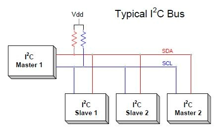
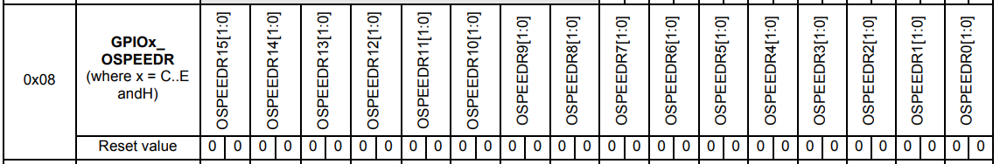
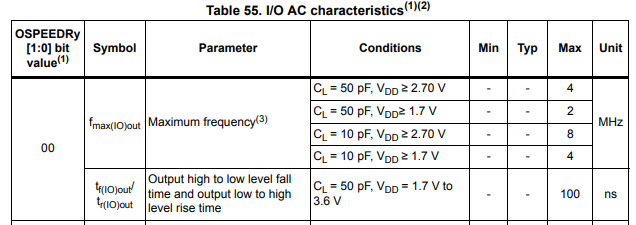
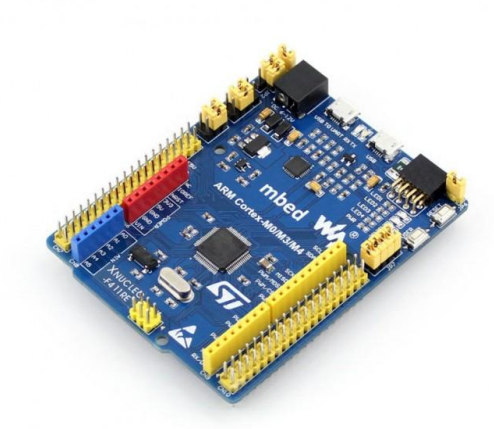
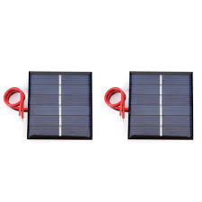
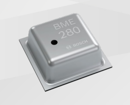
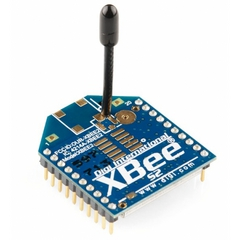

:imagesdir: .
:toc: macro
:toc-title: Содержание
:icons: font
:figure-caption: Рисунок
:table-caption: Таблица
:stem: latexmath
:source-highlighter: coderay


:toc: left

= Анализ требований к разработке метеостанции с передачей параметров по Bluetooth

== Требования к разработке

[#Требования]
.Требования к разработке
[options="header", cols="1,3"]
|=====================
| Параметр | Требование
| Отладочная плата | XNUCLEO-F411RE (STM32F411RE)
| Питание | От солнечной батареи
| Датчик давления, влажности, температуры | BME280
| Интерфейс с датчиком | I2C (адрес 0x76 или 0x77)
| Период измерения | 100 мс
| Расчётная величина | Точка росы (на основе температуры и влажности)
| Беспроводной интерфейс | Bluetooth HC-06
| Интерфейс с Bluetooth | USART2
| Период передачи | 1 секунда
| Формат вывода | "Давление: XXX.XX гПа Влажность: XXX.XX % Температура: XXX.XX C Точка росы: XXX.XX C"
| Язык приложения | C++
| ОС реального времени | FreeRTOS + C++ обёртка
| Архитектура | UML (StarUML)
| Документация | Asciidoc, GitHub, ГОСТ 19.402–78
| Стандарт кодирования | Стэнфордского университета
|=====================

[#Формат вывода]
.Формат вывода данных по Bluetooth
[options="header", cols="1,3"]
|=====================
| Величина | Формат
| Давление | XXX.XX гПа
| Влажность | XXX.XX %
| Температура | XXX.XX C
| Точка росы | XXX.XX C
|=====================

== Общая схема устройства

На рисунке <<#Блок-схема-взаимодействия>> показана общая схема устройства.

**Принцип работы:**

- **Вход:** давление, влажность, температура (датчик BME280 по I2C).
- **Обработка:** расчёт точки росы на основе температуры и влажности.
- **Выход:** передача всех четырёх параметров через Bluetooth-модуль HC-06 на смартфон.
- **Питание:** солнечная батарея с контроллером заряда и аккумулятором.

== Детальное описание блоков


[#Блок-схема-взаимодействия]
.Блок-схема взаимодействия компонентов 
[plantuml, "interaction-diagram", png]
----
@startuml
!theme plain
skinparam backgroundColor #FEFEFE
skinparam componentStyle rectangle

' Границы системы
rectangle "Метеостанция" as System {
    
    ' === Задачи FreeRTOS ===
    rectangle "SensorTask\n(приоритет 2, период 100 мс)" as Sensor
    rectangle "BluetoothTask\n(приоритет 1, период 1 с)" as BTTask
    
    ' === Очередь ===
    database "Queue\n(WeatherData)" as Queue
    
    ' === Драйверы / периферия ===
    rectangle "Драйвер I2C1" as I2C
    rectangle "Драйвер BME280" as BME
    rectangle "Драйвер USART2" as USART
}

' === Внешние устройства ===
rectangle "Солнечная батарея" as Solar
rectangle "Датчик BME280" as BME280_Sensor
rectangle "Bluetooth модуль HC-06" as HC06
rectangle "Смартфон / ПК" as Phone

' === Питание ===
Solar -down-> System : питание

' === Связи внутри системы ===
Sensor -right-> Queue : отправляет WeatherData
Queue -right-> BTTask : получает WeatherData

Sensor <-down-> BME : вызывает read()
BME <-down-> I2C : использует
I2C <-down-> BME280_Sensor : I2C (SDA, SCL)

BTTask -down-> USART : sendString()
USART -down-> HC06 : USART2 (TX/RX)
HC06 -right-> Phone : Bluetooth SPP

' === Примечания ===
note top of Sensor : vTaskDelayUntil(100 мс)
note top of BTTask : vTaskDelayUntil(1000 мс)
@enduml
----

=== 1. Блок измерения параметров (BME280)

==== 1.1 Зачем нужен этот блок

Метеостанция должна знать давление, влажность и температуру окружающей среды. Без этого блока устройство не сможет выполнять свою основную функцию — измерять метеопараметры и передавать их на смартфон или компьютер.

==== 1.2 Что делает

Измеряет три параметра одновременно: атмосферное давление (300–1100 гПа), относительную влажность (0–100%) и температуру (-40…+85 °C). Превращает физические величины в цифры, понятные микроконтроллеру.

==== 1.3 Вход и выход

*Вход:* отсутствует (измеряет внешнюю среду)

*Выход:* сырые цифровые значения давления, влажности и температуры (RAW data), которые затем преобразуются в физические единицы с использованием калибровочных коэффициентов.

==== 1.4 Из чего состоит


Выбор интерфейса осуществляется автоматически в зависимости от состояния CSB (выбора чипа). Если CSB подключён к VDDIO, активен интерфейс I2C. При подключении CSB к VDDIO включается интерфейс SPI. После первого подключения CSB к VDDIO (независимо от наличия тактовых циклов) интерфейс FC отключается до следующего сброса при включении питания. Это предотвращает случайное декодирование SPI-трафика как данных I2C для другого рабочего устройства.Поскольку запуск устройства откладывается до установления напряжений VDD и VDDIO, риск ошибочной обнаружения протокола отсутствует благодаря использованной последовательности включения питания. Однако при использовании I2c, если CSB не подключён напрямую к VDDIO, а к программируемому выводу, необходимо обеспечить, чтобы этот вывод уже обеспечивал выход напряжения VDDIO во время сброса при включении питания. В противном случае устройство останется в режиме SPI и не будет реагировать на команды I2C.


.I2C интерфейс BME280



- Датчик BME280 (маленькая плата с микросхемой Bosch Sensortec)
- Интерфейс I2C (провода: питание, земля, SDA, SCL)
- Подтягивающие резисторы на линиях SDA и SCL (обычно 4.7 кОм)
- Программный драйвер (библиотека Bosch BME280_driver)

==== 1.5 Какие пины и регистры задействованы


Прежде чем приступать к программной настройке, необходимо настроить аппаратную. Для этого нужно правильно подключить пины CSB и SDO, которые отвечают за выбор интерфейса и адресацию.

.Пины BME280
[cols="1,1,1,3", options="header"]
|===
| Пин | Имя | Шина | Зачем
| CSB | chip select | VDDIO | Включает интерфейс I2C для BME280
| SDO | data output | GND | Установка slave адреса 0x76 для I2C
|===

Согласно даташиту на отладочную плату XNUCLEO-F411RE и документации на STM32F411RE, для подключения BME280 по I2C используются следующие пины и регистры:

[options="header", cols="2,3,3,4"]
|=====================
| Сигнал | Пин на плате | Порт/пин MCU | Регистры настройки
| **VCC** | 3.3V | — | —
| **GND** | GND | — | —
| **SDA** (данные) | A4/PB7 | PB7 | GPIOB_MODER (альтернативный режим), GPIOB_OTYPER (open-drain), GPIOB_AFRL (AF4 для I2C1)
| **SCL** (такт) | A5/PB6 | PB6 | GPIOB_MODER (альтернативный режим), GPIOB_OTYPER (open-drain), GPIOB_AFRL (AF4 для I2C1)
|=====================

*Пояснение:* I2C1 расположен на пинах PB6 (SCL) и PB7 (SDA). Альтернативная функция AF4 включает I2C1 на этих пинах. Режим open-drain обязателен для работы I2C.

*Выбор адреса BME280:*
- Если вывод `ADDR` подключён к GND → адрес `0x76`
- Если вывод `ADDR` подключён к VCC (или висит в воздухе) → адрес `0x77`

==== 1.6 Настройка датчика BME280

Перед началом работы с датчиком необходимо настроить GPIO для I2C, сам модуль I2C и выполнить инициализацию датчика.

==== 1.5.1 Настройка модуля I2C1 для работы с датчиком BME280

===== Включение тактирования на порт GPIOB и модуль I2C1

Подключение BME280 осуществляется по линиям PB8(SCL) и PB9(SDA), которые принадлежат порту GPIOB. Поэтому необходимо включить тактирование на этот порт, а также на модуль I2C1, который будет использоваться для обмена данными с датчиком.

.Регистр: `RCC->AHB1ENR`
[cols="1,1,1,3", options="header"]
|===
| Бит | Имя | Значение | Зачем
| 1 | GPIOBEN | 1 | Включает тактирование на порт B (GPIOB). Без этого нельзя управлять выводами PB8 (SDA) и PB9 (SCL).
|===

.Регистр: `RCC->APB1ENR`
[cols="1,1,1,3", options="header"]
|===
| Бит | Имя | Значение | Зачем
| 21| I2C1EN | 1 | Включает тактирование модуля I2C1. Без этого модуль не будет работать.
|===

===== Настройка выводов PB8 (SCL) и PB9 (SDA)

Теперь, когда тактирование на порт GPIOB и модуль I2C1 включено, необходимо настроить выводы PB8 и PB9 для работы в режиме альтернативной функции, которая соответствует I2C1_SCL и I2C1_SDA соответственно. Также нужно установить их как выходы с открытым стоком, настроить скорость и подтяжку к питанию.

.Регистр: `GPIOB->MODER`
[cols="1,1,1,3", options="header"]
|===
| Бит | Имя | Значение | Зачем
| 17:16 | MODER8 | 0b10 | Переводит вывод PB8 в режим альтернативной функции (для I2C1_SCL).
| 19:18 | MODER9 | 0b10 | Переводит вывод PB9 в режим альтернативной функции (для I2C1_SDA).
|===

.Регистр: `GPIOB->AFRL`
[cols="1,1,1,2", options="header"]
|===
| Биты | Имя | Значение | Зачем
| 3:0 | AFRH8 | 0b0100 | Переводит PB8 в альтернативный режим AF4
| 7:4 | AFRH9 | 0b0100 | Переводит PB9 в альтернативный режим AF4
|===

Так как необходимо задать помимо программного режима работы порта его аппаратную часть, но необходимо объявить соответствующие порты как выходы с открытым стоком, так как I2C требует такого режима для правильной работы.

.Регистр: `GPIOB->OTYPER`
[cols="1,1,1,3", options="header"]
|===
| Бит | Имя | Значение | Зачем
| 8 | OT8 | 1 | Устанавливает вывод PB8 как выход с открытым стоком (open-drain).
| 9 | OT9 | 1 | Устанавливает вывод PB9 как выход с открытым стоком (open-drain).
|===

Для установления оптимального соотношения между скоростью передачи данных и помехоустойчивостью, рекомендуется настроить скорость выводов PB8 и PB9 на «низкую» (Low speed). Но это не обязательно настраивать, так как по умолчанию скорость уже установлена на низкую.

.Значения по умолчанию для регистра OSPEEDR


Конкретная скорость представлена на рисунке <<Выдержка из документации на МК>> из документации на МК.

[#Выдержка из документации на МК]
.Выдержка из документации на МК


В соответствии со спецификацией на интерфейс I2C необходимо соеденить линии SCL и SDA с питанием через резисторы подтяжки. Поэтому необходимо включить внутреннюю подтяжку к питанию(pull-up) на выводах PB8 и PB9. 

По умолчанию подтяжка к питанию включена для PB4. (0x0000 0100)
.Регистр: `GPIOB->PUPDR`
[cols="1,1,1,3", options="header"]
|===
| Бит | Имя | Значение | Зачем
| 19:18 | PUPDR9 | 0b01 | Включает подтяжку к питанию на PB9 (Pull-up).
| 17:16 | PUPDR8 | 0b01 | Включает подтяжку к питанию на PB8 (Pull-up).
|===

===== Сброс модуля I2C1

Это необходимо для гарантированного перехода в состояние по умолчанию, что особенно важно, если до этого модуль использовался и мог быть настроен на другой режим работы. Сброс модуля I2C1 обеспечит его корректную инициализацию при последующей настройке.
.Регистр: `RCC->APB1RSTR`
[cols="1,1,1,3", options="header"]
|===
| Бит | Имя | Значение | Зачем
| 21 | I2C1RST | 1 | Сбрасывает I2C1 в состояние по умолчанию.
| 21 | I2C1RST | 0 | Отключает сброс, модуль готов к настройке.
|===

===== Отключение I2C1 перед настройкой
Для защиты от случайного изменения регистров во время настройки, рекомендуется отключить модуль I2C1. Это гарантирует, что он не будет пытаться обмениваться данными или реагировать на внешние сигналы, пока мы не закончим настройку всех параметров. После завершения настройки мы снова включим модуль для нормальной работы.
В STM32F401RE модуль I2C1 отключается и включается с помощью бита PE (Peripheral Enable) в регистре CR1. Установка этого бита в 0 отключает модуль, а установка в 1 включает его. Поэтому на этом этапе мы установим PE в 0, чтобы отключить I2C1 перед началом настройки.

Пример ограничения настройки, связанный с битом PE: 

The CCR register must be configured only when the I2C is disabled (PE = 0).

TRISE[5:0] must be configured only when the I2C is disabled (PE = 0).

Когда бит в состоянии "1" нельзя изменять регистры:

.Регистр: `I2C1->CR1`
[cols="1,1,1,3", options="header"]
|===
| Бит | Имя | Значение | Зачем
| 0 | PE | 0 | Отключает модуль I2C1 (Peripheral Enable). Без этого нельзя изменять некоторые регистры.
|===

===== Настройка частоты шины PCLK1 (вход тактирования I2C1)

Теперь сообщим модулю I2C1, на какой частоте работает его тактирование. Это важно для правильной генерации сигналов SCL и SDA, а также для расчёта таймингов. В нашем случае PCLK1 работает на 8 МГц, так как мы используем HSE 8 МГц без делителя на APB1. Поэтому в регистре CR2 установим значение FREQ = 0b1000, что соответствует частоте 8 МГц.
.Регистр: `I2C1->CR2`
[cols="1,1,1,3", options="header"]
|===
| Бит | Имя | Значение | Зачем
| 0:5 | FREQ | 0b1000 | Указывает частоту PCLK1 = 8 МГц (так как мы работаем от HSE 8 МГц, и делитель APB1 не меняли). Необходимо для генератора таймингов I2C.
|===

===== Настройка скорости передачи (100 кГц) для режима Standard-mode

Так как в проекте предполагается использовать питание от солнечной панели, а это не самый мощный источник энергии, необходимо выбирать самые экономичные режимы работы из доступных. Таковым является снижение частоты. Ведь когда на шинах SDA и SCL логический 0, то ток течёт от питания к земле через подтягивающий резистор. Таким образом, удаётся сэкономить часть энергии, затрачиваеомой на переключение линий из одного логического состояния в другое.

При stem:[f_{PCLK1}] = 8 МГц значение stem:[T_{PCLK1}] = 125 нс.


Рассчитаем значение частоты I2C, для регистра CCR.
Формула для расчёта значения регистра `CCR` в стандартном режиме I2C:

[.text-center]
stem:[CCR = \frac{f_{PCLK1}}{2 \cdot f_{SCL}}]


где:

* stem:[f_{PCLK1}] — частота тактирования шины APB1 (в Гц);

* stem:[f_{SCL}] — желаемая частота работы шины I2C (в Гц).

Подставим значения:

stem:[f_{PCLK1}] = 8000000 Гц

stem:[f_{SCL}] = 100000 Гц

Получим:
stem:[CCR = \frac{8000000}{2 \cdot 100000} = 40]


.Регистр: `I2C2->CCR`
[cols="1,1,1,3", options="header"]
|===
| Бит | Имя | Значение | Зачем
| 0:11 | CCR | 0b00101000 | Контроль частоты I2C (Число 40 в 16СС)
| 15 | FS | 0 | Режим Standard-mode (до 100 кГц). Для более высоких скоростей нужно устанавливать FS=1(Fast-mode)."
|===

В Standart Mode максимально доступное время нарастания SCL составляет 1000 нс. И это при 100 кГц. Так как у меня настроен режим 10 кГц выберу 10000 нс для расчёта.

Формула для расчёта значения регистра `TRISE` в стандартном режиме I2C:

[.text-center]
stem:[TRISE = \frac{t_{HIGH}}{T_{PCLK1}}+1]


Подставим значения:

Получим:
stem:[TRISE = \frac{1000}{125}+1=9]

stem:[9_{10CC}=0b1001_{2CC}]

.Регистр: `I2C2->TRISE`
[cols="1,1,1,3", options="header"]
|===
| Бит | Имя | Значение | Зачем
| 0:5 | TRISE | 0b1001 | Задаёт максимальное время нарастания сигнала. В данном случае 1 мкс
|===

===== Включение I2C1
==== 1.5.2 Настройка датчика BME280

[options="header", cols="2,3,3,4"]
|=====================
| Действие | Регистр датчика | Значение | Назначение
| Сброс | `0xE0` | `0xB6` | Сброс датчика в исходное состояние
| Чтение калибровок | `0x88`…`0x9F` | — | Чтение 24 байт калибровочных коэффициентов
| Настройка влажности | `0xF2` | `0x01` | Влажность с oversampling ×1
| Настройка давления и температуры | `0xF4` | `0x27` | T×1, P×1, нормальный режим
| Конфигурация | `0xF5` | `0x00` | Standby 0.5 мс, фильтр выключен
|=====================

==== 1.7 Как работает (по шагам)

Каждые 100 мс происходит следующее:

1. Микроконтроллер отправляет START condition на шину I2C.
2. Отправляет адрес датчика (0x76 или 0x77) с битом записи.
3. Отправляет команду на чтение регистров данных (0xF7…0xFE).
4. Датчик возвращает 8 байт (давление 3 байта, температура 3 байта, влажность 2 байта).
5. Микроконтроллер отправляет STOP condition.
6. Из сырых байт собираются 20-битные (давление, температура) и 16-битное (влажность) значения.
7. С использованием калибровочных коэффициентов значения преобразуются в физические единицы.

==== 1.8 Математическая модель датчика BME280

Документация основана на официальном даташите Bosch Sensortec (пункт 4.2.3) и представляет полную математическую модель преобразования сырых данных АЦП в физические величины: температуру, давление и относительную влажность.

Модель включает три независимых блока компенсации, объединённых общей промежуточной величиной `t_fine`, которая вычисляется на этапе температурной компенсации и используется затем для давления и влажности.

[#blok-shema-preobrazovaniya-dannyh]
.Блок-схема преобразования данных BME280
[plantuml, "bme280-dataflow", png]
----
@startuml
!theme plain
skinparam backgroundColor #FEFEFE
skinparam componentStyle rectangle
skinparam defaultFontName Arial

title Математическая модель BME280 - поток данных от АЦП до физических величин

' === Входные данные (сырые значения АЦП) ===
rectangle "adc_T\n(20 бит, 0…1048575)" as adc_T #LightBlue
rectangle "adc_P\n(20 бит, 0…1048575)" as adc_P #LightBlue
rectangle "adc_H\n(16 бит, 0…65535)" as adc_H #LightBlue

' === Калибровочные коэффициенты ===
rectangle "dig_T1, dig_T2, dig_T3" as cal_T #LightYellow
rectangle "dig_P1 … dig_P9" as cal_P #LightYellow
rectangle "dig_H1 … dig_H6" as cal_H #LightYellow

' === Блоки компенсации ===
rectangle "Компенсация\nтемпературы" as Comp_T #LightGreen
rectangle "Компенсация\nдавления" as Comp_P #LightGreen
rectangle "Компенсация\nвлажности" as Comp_H #LightGreen

' === Промежуточная переменная ===
database "t_fine" as t_fine #Thistle

' === Выходные данные ===
rectangle "T_X100\n(°C × 100, int32)" as T_X100 #LightCoral
rectangle "p_Q24_8\n(Па × 256, uint32)" as p_Q24_8 #LightCoral
rectangle "H_Q22_10\n(%RH × 1024, uint32)" as H_Q22_10 #LightCoral

' === Финальные значения ===
rectangle "T_C = T_X100/100\n[°C]" as T_final #Lime
rectangle "P_Pa = p/256\n[Па]" as P_final #Lime
rectangle "H_RH = H/1024\n[%RH]" as H_final #Lime

' === Блок точки росы ===
rectangle "Точка росы\n(Magnus)" as DewPoint #Lavender
rectangle "Td_C\n[°C]" as Td_final #Lime

' === Связи температуры ===
adc_T -down-> Comp_T
cal_T -down-> Comp_T : калибровка
Comp_T -down-> t_fine : var1 + var2
t_fine -down-> T_X100 : (t_fine × 5 + 128) >> 8
T_X100 -down-> T_final : ÷ 100

' === Связи давления ===
adc_P -down-> Comp_P
cal_P -down-> Comp_P : калибровка
t_fine -right-> Comp_P : используется
Comp_P -down-> p_Q24_8
p_Q24_8 -down-> P_final : ÷ 256

' === Связи влажности ===
adc_H -down-> Comp_H
cal_H -down-> Comp_H : калибровка
t_fine -right-> Comp_H : используется
Comp_H -down-> H_Q22_10
H_Q22_10 -down-> H_final : ÷ 1024

' === Связи точки росы ===
T_final -down-> DewPoint
H_final -down-> DewPoint
DewPoint -down-> Td_final : Td = (b×α)/(a−α)

@enduml
----


=== 1.8.1. Температура

Преобразование сырого значения АЦП температуры в температуру в градусах Цельсия с разрешением 0.01°C.

[source]
----
Входные данные:
  adc_T    - сырое значение АЦП температуры (20 бит, беззнаковое)
  dig_T1   - калибровочный коэффициент (uint16, адреса 0x88-0x89)
  dig_T2   - калибровочный коэффициент (int16, адреса 0x8A-0x8B)
  dig_T3   - калибровочный коэффициент (int16, адреса 0x8C-0x8D)

Выходные данные:
  T_C      - температура в градусах Цельсия (double)
----

Действия расчета температуры:

:stem: latexmath
:eqnums:
:equation-caption: формула

[[step1]]
[stem]
++++
\begin{equation}
var1 = ((adc_T \gg 3) - (dig_T1 \ll 1)) \times dig_T2 \gg 11
\end{equation}
++++

[[step2]]
[stem]
++++
\begin{equation}
var2 = ((adc_T \gg 4) - dig_T1)^2 \gg 12 \times dig_T3 \gg 14
\end{equation}
++++

[[step3]]
[stem]
++++
\begin{equation}
t\_fine = var1 + var2
\end{equation}
++++

[[step4]]
[stem]
++++
\begin{equation}
T\_X100 = (t\_fine \times 5 + 128) \gg 8
\end{equation}
++++

[[step5]]
[stem]
++++
\begin{equation}
T\_C = T\_X100 / 100
\end{equation}
++++

[source]
----
Примечания:
  - t_fine сохраняется как глобальная переменная для использования в формулах давления и влажности
  - T_X100 представляет температуру в °C × 100 (целое число)
  - Пример: T_X100 = 2435 соответствует T_C = 24.35°C
  - Диапазон: от -40.00°C до +85.00°C
----
=== 1.8.2. Давление

Преобразование сырого значения АЦП давления в атмосферное давление в паскалях. Для достижения максимальной точности требуется 64-битная целочисленная арифметика.

:stem: latexmath
:eqnums:
:equation-caption: формула

[[p_step1]]
[stem]
++++
\begin{equation}
var1 = t\_fine - 128000 \tag{6}
\end{equation}
++++

[[p_step2]]
[stem]
++++
\begin{equation}
var2 = var1 \times var1 \times dig\_P6 \tag{7}
\end{equation}
++++

[[p_step3]]
[stem]
++++
\begin{equation}
var2 = var2 + (var1 \times dig\_P5 \ll 17) \tag{8}
\end{equation}
++++

[[p_step4]]
[stem]
++++
\begin{equation}
var2 = var2 + (dig\_P4 \ll 35) \tag{9}
\end{equation}
++++

[[p_step5]]
[stem]
++++
\begin{equation}
var1 = (var1 \times var1 \times dig\_P3 \gg 8) + (var1 \times dig\_P2 \ll 12) \tag{10}
\end{equation}
++++

[[p_step6]]
[stem]
++++
\begin{equation}
var1 = ((1 \ll 47) + var1) \times dig\_P1 \gg 33 \tag{11}
\end{equation}
++++

[[p_step8]]
[stem]
++++
\begin{equation}
p = 1048576 - adc\_P \tag{12}
\end{equation}
++++

[[p_step9]]
[stem]
++++
\begin{equation}
p = ((p \ll 31) - var2) \times 3125 / var1 \tag{13}
\end{equation}
++++

[[p_step10]]
[stem]
++++
\begin{equation}
var1 = dig\_P9 \times (p \gg 13) \times (p \gg 13) \gg 25 \tag{14}
\end{equation}
++++

[[p_step11]]
[stem]
++++
\begin{equation}
var2 = dig\_P8 \times p \gg 19 \tag{15}
\end{equation}
++++

[[p_step12]]
[stem]
++++
\begin{equation}
p = ((p + var1 + var2) \gg 8) + (dig\_P7 \ll 4) \tag{16}
\end{equation}
++++

[[p_step13]]
[stem]
++++
\begin{equation}
P\_Pa = p / 256 \tag{17}
\end{equation}
++++

**Важное примечание:** перед выполнением формулы (12) необходимо проверить условие:

Если \( var1 = 0 \), то расчёт невозможен — следует вернуть 0 (ошибка).


[source]
----
Примечания:
  - Промежуточные вычисления требуют 64-битных целых
  - Выходное значение p представлено в формате Q24.8 (24 целых бита, 8 дробных)
  - Реальное давление в паскалях = p / 256
  - Пример: p = 24674867 → P_Pa = 24674867 / 256 = 96385.2 Па = 963.862 гПа
  - Диапазон: от 300 до 1100 гПа
----


=== 1.8.3. Влажность

Преобразование сырого значения АЦП влажности в относительную влажность в процентах. Для компенсации используется значение `t_fine`, полученное на этапе температурной компенсации.

[source]
----
Входные данные:
  adc_H    - сырое значение АЦП влажности (16 бит, беззнаковое)
  t_fine   - промежуточное значение температуры
  dig_H1   - калибровочный коэффициент (uint8, адрес 0xA1)
  dig_H2   - калибровочный коэффициент (int16, адреса 0xE1-0xE2)
  dig_H3   - калибровочный коэффициент (uint8, адрес 0xE3)
  dig_H4   - калибровочный коэффициент (int16, специальная упаковка: 0xE4-0xE5)
  dig_H5   - калибровочный коэффициент (int16, специальная упаковка: 0xE5-0xE6)
  dig_H6   - калибровочный коэффициент (int8, адрес 0xE7)

Выходные данные:
  H_RH     - относительная влажность в процентах (double)
----

Действия расчета влажности:
:stem: latexmath
:eqnums:
:equation-caption: формула

[[h_step1]]
[stem]
++++
\begin{equation}
var1 = t\_fine - 76800 \tag{18}
\end{equation}
++++

[[h_step2]]
[stem]
++++
\begin{equation}
var1 = (((adc\_H \ll 14) - (dig\_H4 \ll 20) - (dig\_H5 \times var1)) + 16384) \gg 15 \tag{19}
\end{equation}
++++

[[h_step3]]
[stem]
++++
\begin{equation}
var1 = var1 \times ((((((var1 \times dig\_H6) \gg 10) \times ((var1 \times dig\_H3) \gg 11) + 32768) \gg 10) + 2097152) \times dig\_H2 + 8192) \gg 14 \tag{20}
\end{equation}
++++

[[h_step4]]
[stem]
++++
\begin{equation}
var1 = var1 - ((((var1 \gg 15) \times (var1 \gg 15)) \gg 7) \times dig\_H1 \gg 4) \tag{21}
\end{equation}
++++

[[h_step5_6]]
[stem]
++++
\begin{equation}
var1 = 
\begin{cases}
0, & \text{если } var1 < 0 \\
419430400, & \text{если } var1 > 419430400 \\
\end{cases}
\tag{22}
\end{equation}
++++

[[h_step7]]
[stem]
++++
\begin{equation}
H\_Q22\_10 = var1 \gg 12 \tag{23}
\end{equation}
++++

[[h_step8]]
[stem]
++++
\begin{equation}
H\_RH = H\_Q22\_10 / 1024 \tag{24}
\end{equation}
++++

[source]
----
Примечания:
  - Специальная упаковка dig_H4 и dig_H5:
      dig_H4 = (int16_t)((reg0xE4 << 4) | (reg0xE5 & 0x0F))
      dig_H5 = (int16_t)((reg0xE6 << 4) | ((reg0xE5 >> 4) & 0x0F))
  - H_Q22_10 представлено в формате Q22.10 (22 целых бита, 10 дробных)
  - Реальная влажность в %RH = H_Q22_10 / 1024
  - Пример: H_Q22_10 = 47445 → H_RH = 47445 / 1024 = 45.333 %
  - Диапазон: от 0% до 100% RH
----

=== 1.8.4. Точка росы

Вычисление температуры точки росы на основе полученных значений температуры и относительной влажности. Используется аппроксимация Magnus-формулой, рекомендованной Всемирной метеорологической организацией (ВМО).

[source]
----
Входные данные:
  T_C      - температура воздуха в градусах Цельсия
  H_RH     - относительная влажность в процентах (0...100)

Выходные данные:
  Td_C     - температура точки росы в градусах Цельсия (double)
----

:stem: latexmath
:eqnums:
:equation-caption: формула

[[td_step1]]
[stem]
++++
\begin{equation}
\alpha = \frac{a \times T\_C}{b + T\_C} + \ln\left(\frac{H\_RH}{100}\right) \tag{25}
\end{equation}
++++

[[td_step2]]
[stem]
++++
\begin{equation}
Td\_C = \frac{b \times \alpha}{a - \alpha} \tag{26}
\end{equation}
++++

[source]
----
Где:
  - α (альфа) = 17.27 — вспомогательный параметр, вычисляемый по формуле
  - b (бета) = 237.7 — это эмпирический коэффициент, который зависит от выбранной модели и температурного диапазона
  - ln — натуральный логарифм
  - Формула корректна для диапазона температур от -45°C до +60°C
  - Точность формулы составляет ±0.1°C в диапазоне 0-50°C
----


Для применений с ограниченными вычислительными ресурсами может использоваться упрощённая формула с фиксированными коэффициентами.

[source]
----
Входные данные:
  T_C      - температура воздуха в градусах Цельсия
  H_RH     - относительная влажность в процентах (0...100)

Выходные данные:
  Td_C     - температура точки росы в градусах Цельсия (double)
----


:stem: latexmath
:eqnums:
:equation-caption: формула

[[td_approx]]
[stem]
++++
\begin{equation}
Td\_C = T\_C - \frac{100 - H\_RH}{5} \tag{27}
\end{equation}
++++

[source]
----
Примечания:
  - Упрощённая формула даёт приблизительный результат
  - Погрешность увеличивается при низкой влажности и низких температурах
  - Рекомендуется использовать только для оценочных расчётов
  - Для точных измерений используется основная Magnus-формула
----


=== 1.8.5. Важные замечания

1. 1. **Последовательность вычислений:**
   - Сначала всегда вычисляется температура с получением `t_fine`
   - Затем давление и/или влажность (могут вычисляться независимо после получения `t_fine`)
   - Точка росы вычисляется последней, после получения `T_C` и `H_RH`

2. **Требования к разрядности:**
   - Температура и влажность используют 32-битную арифметику
   - Давление требует 64-битной арифметики для сохранения точности
   - Точка росы может использовать 32-битную арифметику с плавающей точкой

3. **Калибровочные данные:** должны быть считаны из NVM перед началом вычислений.

4. **Форматы выходных данных:**
   - Температура: целое × 100 (0.01°C разрешение)
   - Давление: Q24.8 формат (деление на 256 для получения Па)
   - Влажность: Q22.10 формат (деление на 1024 для получения %RH)
   - Точка росы: double (прямое значение в °C)

5. **Клиппинг влажности:** выходное значение ограничивается диапазоном 0-100% RH даже если формула даёт значение вне этого диапазона.

6. **Обработка ошибок давления:** при `var1 == 0` функция возвращает 0 во избежание деления на ноль.

7. **Ограничения формулы точки росы:**
   - Magnus-формула корректна при температурах от -45°C до +60°C
   - При относительной влажности 100% температура точки росы равна температуре воздуха
   - При относительной влажности менее 1% расчёты могут быть неточными


[#matematicheskaya-model-bme280]


== 2. Bluetooth-модуль HC-06

=== 2.1 Зачем нужен этот блок

Данные метеостанции должны передаваться на внешнее устройство (смартфон, ноутбук) без проводов. Bluetooth-модуль HC-06 обеспечивает беспроводную связь по протоколу SPP (Serial Port Profile).

=== 2.2 Что делает

Преобразует данные, полученные по USART2 от микроконтроллера, в Bluetooth-сигнал и передаёт их на подключённое устройство.

==== 2.3 Вход и выход

*Вход:* текстовая строка от микроконтроллера по USART2 (TX → RXD модуля)

*Выход:* Bluetooth-сигнал на частоте 2.4 ГГц, принимаемый смартфоном или компьютером

=== 2.4 Из чего состоит

- Модуль HC-06 на чипе CSR BC417143B
- Встроенная антенна 2.4 ГГц
- Flash-память 8 Mbit для хранения настроек
- Разъём для подключения (4 пина: VCC, GND, TXD, RXD)

==== 2.5 Какие пины и регистры задействованы

[options="header", cols="2,3,3,4"]
|=====================
| Сигнал | Пин на HC-06 | Порт/пин MCU | Назначение
| **VCC** | VCC | 3.3V или 5V | Питание модуля
| **GND** | GND | GND | Общая земля
| **RXD** (приём) | UART_RX (pin2) | PA2 (USART2_TX) | Передача данных от STM32 к модулю
| **TXD** (передача) | UART_TX (pin1) | PA3 (USART2_RX) | (Опционально) приём данных от модуля
|=====================

*Важно:* На плате XNUCLEO-F411RE встроенный USB-UART преобразователь CP2102 по умолчанию подключён к тем же PA2/PA3. Джампер `UART` должен быть разомкнут.

=== 2.6 Параметры HC-06 по умолчанию

[options="header", cols="2,2"]
|=====================
| Параметр | Значение
| Скорость UART | 9600 бод
| Биты данных | 8
| Стоп-биты | 1
| Чётность | Нет
| Имя устройства | linvor
| Пароль | 1234
|=====================

=== 2.7 Настройка USART2 для связи с HC-06

==== Настройка GPIO для USART2

[options="header", cols="2,3,3,4"]
|=====================
| Регистр | Биты | Значение | Назначение
| `RCC->AHB1ENR` | `GPIOAEN` | 1 | Включение тактирования порта A
| `GPIOA->MODER` | `MODER2`, `MODER3` | `10` (альтернативный) | Настройка PA2 (TX) и PA3 (RX) под USART
| `GPIOA->AFRL` | `AFRL2`, `AFRL3` | `0111` (AF7) | Привязка пинов к USART2
| `GPIOA->OTYPER` | `OT2` | `0` | PA2 как push-pull (для TX)
| `GPIOA->OSPEEDR` | `OSPEEDR2` | `11` | Высокая скорость для PA2
|=====================

==== Настройка модуля USART2

[options="header", cols="2,3,3,4"]
|=====================
| Регистр | Биты | Значение | Назначение
| `RCC->APB1ENR` | `USART2EN` | 1 | Включение тактирования USART2
| `USART2->CR1` | `M` | 0 | 8 бит данных
| `USART2->CR2` | `STOP[1:0]` | `00` | 1 стоп-бит
| `USART2->CR1` | `PCE` | 0 | Без проверки чётности
| `USART2->CR1` | `OVER8` | 0 | Оверсемплинг 16
| `USART2->BRR` | `DIV_Mantissa[11:4]` | `104` | Целая часть делителя (16 МГц / (9600 * 16) = 104)
| `USART2->BRR` | `DIV_Fraction[3:0]` | `3` | Дробная часть делителя
| `USART2->CR1` | `TE` | 1 | Включение передатчика
| `USART2->CR1` | `UE` | 1 | Включение USART2
|=====================

=== 2.8 Как работает (по шагам)

1. STM32 формирует строку по заданному формату.
2. STM32 отправляет строку через USART2 на вывод PA2 (TX).
3. HC-06 принимает данные на свой вход RXD.
4. HC-06 передаёт данные по Bluetooth на подключённое устройство.
5. Смартфон (или ПК) отображает строку в терминале.

=== 2.9 AT-команды HC-06

Для настройки модуля используются AT-команды (отправляются до установки соединения):

[options="header", cols="2,4"]
|=====================
| Команда | Описание
| `AT` | Проверка связи (ответ `OK`)
| `AT+VERSION` | Версия прошивки
| `AT+NAME<имя>` | Сменить имя устройства
| `AT+PIN<xxxx>` | Сменить пароль (4 цифры)
| `AT+BAUD4` | Установить скорость 9600 бод
| `AT+BAUD6` | Установить скорость 38400 бод
|=====================

=== 2.10 Что может пойти не так

[options="header", cols="2,3,3"]
|=====================
| Проблема | Причина | Решение
| Нет данных на смартфоне | Джампер UART замкнут | Разомкнуть джампер на плате
| Данные в виде иероглифов | Не совпадает скорость | Проверить USART_BRR, переключить HC-06 на 9600
| HC-06 не виден смартфоном | Нет питания | Проверить VCC и GND
| Не подключается к модулю | Неправильный пароль | Использовать `1234` или сменить через AT+PIN
|=====================

== 3. Архитектура FreeRTOS

В программе используется операционная система реального времени FreeRTOS с C++ обёрткой. Это позволяет выполнять несколько задач с заданной периодичностью.

=== 3.1 Задачи FreeRTOS

[options="header", cols="2,3,3,3"]
|=====================
| Задача | Период | Что делает | Приоритет
| `SensorTask` | 100 мс | Читает BME280 по I2C, рассчитывает точку росы | Высокий (2)
| `BluetoothTask` | 1000 мс | Форматирует строку и отправляет через USART2 | Средний (1)
|=====================

=== 3.2 Структура данных для обмена

```cpp
struct WeatherData {
  float pressure;      // гПа
  float humidity;      // %
  float temperature;   // °C
  float dewPoint;      // °C
  uint32_t timestamp;  // время измерения
};
```

=== 3.3 Очередь для передачи данных

Для передачи данных от `SensorTask` к `BluetoothTask` используется очередь FreeRTOS:

```cpp
QueueHandle_t xWeatherQueue;
xWeatherQueue = xQueueCreate(5, sizeof(WeatherData));
```

=== 3.4 Описание работы

==== 3.4.1 Инициализация (выполняется один раз при запуске)

1. Настройка тактирования (RCC)
2. Настройка GPIO для I2C1 (PB6, PB7)
3. Настройка I2C1 (100 кГц)
4. Инициализация BME280 (сброс, чтение калибровок, настройка режимов)
5. Настройка GPIO для USART2 (PA2, PA3)
6. Настройка USART2 (9600 бод, 8N1)
7. Создание очереди `xWeatherQueue`
8. Создание задач FreeRTOS
9. Запуск планировщика FreeRTOS

==== 3.4.2 SensorTask (период 100 мс)

1. Чтение давления, влажности и температуры с BME280 по I2C
2. Расчёт точки росы по формуле Магнуса
3. Заполнение структуры `WeatherData`
4. Отправка структуры в очередь `xWeatherQueue`
5. Переход в спящий режим до следующего периода

==== 3.4.3 BluetoothTask (период 1000 мс)

1. Получение данных из очереди `xWeatherQueue` (блокировка до 100 мс)
2. Если очередь пуста — использование последних валидных данных
3. Форматирование строки по заданному шаблону:
   `"Давление: XXX.XX гПа Влажность: XXX.XX % Температура: XXX.XX C Точка росы: XXX.XX C\r\n"`
4. Отправка строки через USART2
5. Переход в спящий режим до следующего периода

=== 3.5 Приоритеты задач

[options="header", cols="2,2,3"]
|=====================
| Задача | Приоритет | Почему
| `SensorTask` | Высокий (2) | Должен строго соблюдать период 100 мс
| `BluetoothTask` | Средний (1) | Может иметь небольшие задержки
|=====================

=== 3.6 Синхронизация

- **Очередь:** потокобезопасная передача данных от SensorTask к BluetoothTask
- **vTaskDelayUntil:** точное соблюдение периодов без дрейфа

== 4. Формат выходных данных

=== 4.1 Пример строки

```
Давление: 1013.25 гПа Влажность: 54.30 % Температура: 22.50 C Точка росы: 12.70 C
```

=== 4.2 Правила форматирования

[options="header", cols="2,2,4"]
|=====================
| Величина | Формат | Примечание
| Давление | `XXX.XX` | 2 знака после запятой, 5 символов всего
| Влажность | `XXX.XX` | 2 знака после запятой, 5 символов всего
| Температура | `XXX.XX` | 2 знака после запятой, 5 символов всего
| Точка росы | `XXX.XX` | 2 знака после запятой, 5 символов всего
| Единицы давления | `гПа` | гектопаскаль
| Единицы влажности | `%` | процент
| Единицы температуры | `C` | градус Цельсия
| Разделитель | пробел | после двоеточия
| Конец строки | `\r\n` | перевод строки и возврат каретки
|=====================

== 5. Алгоритм работы программы (общая схема)

[#Алгоритм]
.Алгоритм работы метеостанции

```
Подача питания
    │
    ▼
Инициализация тактирования (RCC)
    │
    ▼
Инициализация I2C1 (PB6, PB7)
    │
    ▼
Инициализация BME280 (сброс, калибровки)
    │
    ▼
Инициализация USART2 (PA2, PA3, 9600 бод)
    │
    ▼
Создание очереди WeatherData
    │
    ▼
Создание SensorTask (100 мс, приоритет 2)
    │
    ▼
Создание BluetoothTask (1000 мс, приоритет 1)
    │
    ▼
Запуск планировщика FreeRTOS
    │
    ▼
┌─────────────────────────────────────────────────────────────┐
│                     Параллельное выполнение                  │
├─────────────────────────────┬───────────────────────────────┤
│      SensorTask (100 мс)    │    BluetoothTask (1000 мс)     │
├─────────────────────────────┼───────────────────────────────┤
│ 1. Чтение BME280 по I2C     │ 1. Получение из очереди       │
│ 2. Расчёт точки росы        │ 2. Форматирование строки      │
│ 3. Отправка в очередь       │ 3. Отправка по USART2 → HC-06  │
│ 4. Задержка 100 мс          │ 4. Задержка 1000 мс           │
└─────────────────────────────┴───────────────────────────────┘
```

[#analiz-nvic]
== 6 Анализ и описание NVIC

В рамках данной курсовой работы используется микроконтроллер **STM32F411RET6**, входящий в состав отладочной платы **XNUCLEO-F411RE**. Данный МК имеет ядро ARM Cortex-M4 с тактовой частотой до 100 МГц и встроенный контроллер прерываний NVIC.


[#obshchie-svedeniya-nvic]
=== 6.1. Общие сведения о NVIC

NVIC (Nested Vectored Interrupt Controller) — это встроенный контроллер прерываний, который обеспечивает:

- Управление вложенными прерываниями с приоритетами
- Векторизованную обработку прерываний (автоматический переход к обработчику)
- Маскирование индивидуальных прерываний
- Поддержку отложенных прерываний
- Управление энергопотреблением через инструкции WFI/WFE


[#osobennosti-nvic-na-stm32f411re]
=== 6.2. Особенности NVIC на STM32F411RE

[options="header", cols="2,3"]
|=====================
| Параметр | Значение
| Количество прерываний | до 82
| Уровней приоритета | 16 (4 бита)
| Битов приоритета | 4 (от 0 до 15)
| Тип приоритета | 0 — наивысший, 15 — наинизший
| Поддержка вложенности | Да
| Поддержка отложенных прерываний | Да
| Поддержка пошагового режима | Да
| Управление энергопотреблением | Да (WFI/WFE)
|=====================


[#nastroika-prioritetov-pretyvaniy]
=== 6.3. Настройка приоритетов прерываний

В Cortex-M4 приоритет задаётся 8-битным полем, но в STM32F411RE используются только старшие 4 бита (0-15). Значение 0 соответствует наивысшему приоритету, значение 15 — наинизшему.

Примеры распределения приоритетов:
- Значение 0x00 → приоритет 0 (наивысший) — сброс, аппаратные ошибки
- Значение 0x10 → приоритет 1 — внешние прерывания высокой важности
- Значение 0x20 → приоритет 2 — прерывания от DMA
- Значение 0xF0 → приоритет 15 (наинизший) — системный таймер SysTick


[#gruppirovka-prioritetov]
=== 6.4. Группировка приоритетов (Priority Grouping)

NVIC позволяет разделить поле приоритета на две части: групповой приоритет (основной приоритет прерывания) и подприоритет (субпрерывание). В данном проекте используется группировка, при которой все 4 бита отведены под групповой приоритет, а подприоритеты отсутствуют. Это упрощает конфигурацию и делает систему более предсказуемой.

Существуют следующие варианты группировки:

[options="header", cols="2,2,2,3"]
|=====================
| Режим группировки | Групповые биты | Подбиты | Количество уровней
| Режим 0 | 7:4 | 3:0 | 16 групповых, 1 подуровень
| Режим 1 | 7:5 | 4:3:0 | 8 групповых, 2 подуровня
| Режим 2 | 7:6 | 5:4:3:0 | 4 групповых, 4 подуровня
| Режим 3 | 7 | 6:5:4:3:0 | 2 групповых, 8 подуровней
| Режим 4 | — | 7:6:5:4:3:0 | 1 групповой, 16 подуровней
|=====================


[#ispolzuemye-istochniki-pretyvaniy-v-proekte]
=== 6.5. Используемые источники прерываний в проекте

В разрабатываемой метеостанции задействованы следующие прерывания:

[#tablitsa-istochnikov-pretyvaniy]
.Таблица источников прерываний

[options="header", cols="2,4,3,3"]
|=====================
| Прерывание | Источник | Назначение | Приоритет
| EXTI0_IRQn | User Button (кнопка пользователя) | Детектирование нажатия кнопки, запуск дополнительных функций | 3 (высокий)
| DMA1_Stream0_IRQn | DMA канал 0 | Бесконфликтный обмен данными с BME280 по I2C | 7 (высокий)
| I2C1_EV_IRQn | I2C1 события | Обработка событий I2C (старт, стоп, отправка адреса) — альтернативный режим без DMA | 12 (средний)
| I2C1_ER_IRQn | I2C1 ошибки | Обработка ошибок I2C (потеря арбитража, NACK) | 13 (средний)
| USART2_IRQn | USART2 | Приём данных от Bluetooth модуля HC-06 (в текущей версии не используется, только передача) | 10 (средний)
| SysTick_IRQn | Системный таймер SysTick | Планировщик FreeRTOS (переключение задач) | 15 (наинизший)
|=====================


[#skhema-prioritetov-nvic]
.Схема приоритетов прерываний NVIC
=== 6.5. Схема приоритетов прерываний

[plantuml, "nvic-priority-diagram", png]
----
@startuml
!theme plain
skinparam backgroundColor #FEFEFE
skinparam componentStyle rectangle

title Схема приоритетов прерываний NVIC в проекте метеостанции

rectangle "Наивысший приоритет\n(0)" as Top #LightCoral

rectangle "EXTI0_IRQn\n(User Button / Кнопка)\nПриоритет 3" as Button #FFB347

rectangle "DMA1_Stream0_IRQn\n(BME280 / I2C DMA)\nПриоритет 7" as DMA_I2C #FFD700

rectangle "USART2_IRQn\n(HC-06 Bluetooth)\nПриоритет 10" as USART #90EE90

rectangle "I2C1_EV_IRQn\n(События I2C)\nПриоритет 12" as I2C_EV #87CEEB

rectangle "I2C1_ER_IRQn\n(Ошибки I2C)\nПриоритет 13" as I2C_ER #87CEEB

rectangle "SysTick_IRQn\n(FreeRTOS планировщик)\nПриоритет 15" as SysTick #DDA0DD

rectangle "Наинизший приоритет" as Bottom #D3D3D3

Top -down-> Button
Button -down-> DMA_I2C
DMA_I2C -down-> USART
USART -down-> I2C_EV
I2C_EV -down-> I2C_ER
I2C_ER -down-> SysTick
SysTick -down-> Bottom

note right of Button
  Наивысший приоритет среди
  используемых прерываний
  для немедленной реакции
  на нажатие кнопки
end note

note right of DMA_I2C
  Высокий приоритет для
  бесперебойного сбора
  данных с датчика BME280
end note

note right of SysTick
  Наинизший приоритет для
  корректной работы
  планировщика FreeRTOS
end note
@enduml
----


[#poryadok-obrabotki-pretyvaniy]
=== 6.7. Порядок обработки прерываний

При одновременном возникновении нескольких прерываний, NVIC обрабатывает их в следующем порядке:

1. Определяется наивысший активный приоритет среди всех ожидающих прерываний
2. Если в данный момент выполняется обработчик с более низким приоритетом, он прерывается
3. Сохраняется контекст (состояние регистров) прерванной задачи
4. Выполняется обработчик прерывания с более высоким приоритетом
5. После завершения обработчика восстанавливается контекст прерванной задачи
6. Выполнение прерванного кода продолжается

**Пример из проекта:**

В обычном состоянии выполняется задача SensorTask (измерение параметров). В этот момент:
- Системный таймер SysTick (приоритет 15) срабатывает для переключения задач FreeRTOS
- Если во время этого процесса DMA завершает чтение данных с BME280 (приоритет 7), то:
  - Обработчик SysTick прерывается
  - Выполняется обработчик DMA (сохранение полученных данных)
  - После завершения DMA управление возвращается к обработчику SysTick
  - SysTick завершает переключение контекста

Это гарантирует, что данные от датчика никогда не будут потеряны из-за работы планировщика.


[#rekomenduemye-prioritety-dlya-freeertos]
=== 6.8. Приоритеты в конфигурации FreeRTOS

Для корректной работы FreeRTOS необходимо соблюдать следующие правила распределения приоритетов:

[options="header", cols="2,3,2"]
|=====================
| Параметр | Значение | Назначение
| configMAX_PRIORITIES | 5 | Максимальное количество приоритетов задач
| configLIBRARY_LOWEST_INTERRUPT_PRIORITY | 15 | Самый низкий приоритет прерывания для работы с FreeRTOS
| configKERNEL_INTERRUPT_PRIORITY | 15 | Приоритет системного таймера (SysTick)
| configMAX_SYSCALL_INTERRUPT_PRIORITY | 5 | Прерывания с приоритетом выше 5 не могут вызывать API FreeRTOS
|=====================

**Важное замечание:** Прерывания с приоритетом выше значения `configMAX_SYSCALL_INTERRUPT_PRIORITY` (то есть приоритеты 0-4) не могут вызывать функции FreeRTOS API. Это сделано для того, чтобы критически важные прерывания (например, кнопка пользователя с приоритетом 3) не блокировались планировщиком и обрабатывались максимально быстро.


[#tablitsa-funktsiy-nvic]
=== 6.9. Основные функции управления NVIC

Для управления прерываниями используются следующие функции и макросы:

[options="header", cols="2,4"]
|=====================
| Функция / Макрос | Назначение
| `HAL_NVIC_SetPriorityGrouping()` | Установка режима группировки приоритетов (выполняется один раз при инициализации системы)
| `HAL_NVIC_SetPriority()` | Установка приоритета для конкретного прерывания
| `HAL_NVIC_EnableIRQ()` | Включение конкретного прерывания
| `HAL_NVIC_DisableIRQ()` | Выключение конкретного прерывания (используется при переходе в спящий режим)
| `__disable_irq()` | Глобальное запрещение всех прерываний (используется в критических секциях FreeRTOS)
| `__enable_irq()` | Глобальное разрешение всех прерываний
| `__set_BASEPRI()` | Установка минимального приоритета прерываний, которые могут выполняться
|=====================


[#tablitsa-obrabotchikov-pretyvaniy]
=== 6.10. Обработчики прерываний в проекте

Каждому прерыванию соответствует своя функция-обработчик (Interrupt Handler), которая автоматически вызывается при наступлении события:

[options="header", cols="2,4"]
|=====================
| Обработчик | Что делает
| `SysTick_Handler` | Выполняется каждые 1 мс (при частоте 100 МГц). Увеличивает счётчик времени HAL, вызывает переключение задач FreeRTOS
| `DMA1_Stream0_IRQHandler` | Выполняется при завершении передачи данных по DMA. Сохраняет полученные от BME280 данные и сигнализирует задаче SensorTask о готовности новых измерений
| `I2C1_EV_IRQHandler` | Выполняется при событиях I2C (успешная отправка данных, получение подтверждения). Обрабатывает протокол обмена с датчиком
| `I2C1_ER_IRQHandler` | Выполняется при ошибках I2C (отсутствие подтверждения от датчика, потеря арбитража). Сбрасывает состояние шины и пытается восстановить связь
| `USART2_IRQHandler` | Выполняется при приёме данных от Bluetooth модуля (в текущей версии не используется, т.к. данные только передаются)
| `EXTI0_IRQHandler` | Выполняется при нажатии пользовательской кнопки. Может использоваться для принудительной отправки данных или переключения режимов работы
|=====================


[#tablitsa-nastroek-prioritetov]
=== 6.11. Сводная таблица настроек приоритетов

[options="header", cols="2,3,2,4"]
|=====================
| Прерывание | Приоритет | Может вызывать FreeRTOS API | Примечание
| EXTI0_IRQn | 3 | Нет (приоритет выше 5) | Пользовательская кнопка — максимально быстрая обработка
| DMA1_Stream0_IRQn | 7 | Да | Данные BME280 — высокая важность, но не критичнее кнопки
| USART2_IRQn | 10 | Да | Bluetooth — средний приоритет
| I2C1_EV_IRQn | 12 | Да | События I2C — ниже приоритета передачи
| I2C1_ER_IRQn | 13 | Да | Ошибки I2C — наименьший среди I2C прерываний
| SysTick_IRQn | 15 | Да | Планировщик FreeRTOS — наинизший приоритет
|=====================


[#tablitsa-registrov-nvic]
=== 6.12. Основные регистры NVIC

NVIC управляется через следующие регистры (доступны напрямую или через HAL):

[options="header", cols="2,3,3"]
|=====================
| Регистр | Адресное пространство | Назначение
| `NVIC_ISER0` | 0xE000E100 | Включение прерываний 0-31
| `NVIC_ISER1` | 0xE000E104 | Включение прерываний 32-63
| `NVIC_ICER0` | 0xE000E180 | Выключение прерываний 0-31
| `NVIC_ICER1` | 0xE000E184 | Выключение прерываний 32-63
| `NVIC_ISPR0` | 0xE000E200 | Установка ожидающих прерываний (программный вызов)
| `NVIC_ICPR0` | 0xE000E280 | Сброс ожидающих прерываний
| `NVIC_IPR0` | 0xE000E400 | Приоритеты прерываний 0-3
| `NVIC_IPR1` | 0xE000E404 | Приоритеты прерываний 4-7
| ... | ... | ...
| `NVIC_IPR20` | 0xE000E450 | Приоритеты прерываний 80-83
| `SCB->AIRCR` | 0xE000ED0C | Группировка приоритетов (VECTKEY)
|=====================


[#vyvody-po-nvic]
=== 6.13. Выводы по NVIC

NVIC является критически важным компонентом для обеспечения надёжной работы метеостанции. Правильная настройка приоритетов обеспечивает:

- **Своевременную обработку данных** с датчика BME280 — прерывание DMA имеет высокий приоритет 7, что гарантирует сохранность всех измерений
- **Корректную передачу данных** по Bluetooth через HC-06 — прерывание USART2 с приоритетом 10 не конфликтует с более важными задачами
- **Стабильную работу планировщика FreeRTOS** — системный таймер SysTick имеет наинизший приоритет 15, благодаря чему он никогда не блокирует выполнение других прерываний
- **Быструю реакцию на внешние события** — пользовательская кнопка с приоритетом 3 обрабатывается в первую очередь
- **Отсутствие конфликтов** между различными источниками прерываний благодаря чёткому распределению приоритетов

**Итоговое распределение приоритетов (от высшего к низшему):**

1. **Приоритет 3** — Кнопка пользователя (EXTI0) — немедленная реакция
2. **Приоритет 7** — DMA I2C (BME280) — сохранение данных измерения
3. **Приоритет 10** — USART2 (HC-06) — передача данных по Bluetooth
4. **Приоритет 12** — События I2C — управление протоколом
5. **Приоритет 13** — Ошибки I2C — восстановление после сбоев
6. **Приоритет 15** — SysTick (FreeRTOS) — переключение задач

Такая конфигурация гарантирует, что никакое прерывание не заблокирует выполнение SysTick планировщика FreeRTOS, что критически важно для работы всех задач реального времени. Это также гарантирует, что данные с датчика BME280 будут обработаны с минимальной задержкой, а пользовательский интерфейс (кнопка) будет отзываться мгновенно.

== Используемое оборудование

=== Отладочная плата XNUCLEO-F411RE

.Внешний вид платы из документации


Особенности:
- Микроконтроллер STM32F411RET6 (100 МГц, 512 КБ Flash, 128 КБ RAM)
- Поддержка Arduino (пины A4/A5 для I2C, D0/D1 для USART2)
- Встроенный ST-LINK/V2 для отладки и прошивки
- Пользовательский светодиод на PA5
- Кнопка сброса и пользовательская кнопка

=== Солнечная батарея и система питания

.Внешний вид солнечных панелей


Состав:
- Солнечная панель 5-6 В, 200-500 мА
- Коннектор типа 3,5*1,35 мм
=== Датчик BME280

.Внешний вид датчика BME280


Параметры:
- Давление: 300–1100 гПа (±1 гПа)
- Влажность: 0–100% (±3%)
- Температура: -40…+85 °C (±1 °C)
- Интерфейс: I2C (адрес 0x76 или 0x77)
 
=== Bluetooth-модуль HC-06

.Внешний вид модуля связи


Параметры:
- Чип: CSR BC417143B
- Bluetooth V2.0+EDR
- Скорость по умолчанию: 9600 бод
- Пароль по умолчанию: 1234
- Имя по умолчанию: linvor

== Заключение

В ходе выполнения курсовой работы был проведен анализ требований к метеостанции с передачей параметров по Bluetooth на базе отладочной платы XNUCLEO-F411RE.

=== Основные результаты работы

1. **Проанализированы требования** к разработке: определена необходимая периферия (датчик BME280, интерфейс I2C, USART2 для Bluetooth), заданы периоды измерения (100 мс) и передачи (1 секунда).

2. **Разработана структурная схема устройства**, показывающая взаимосвязи всех блоков: от измерения параметров до беспроводной передачи.

3. **Детально описаны все блоки системы**:
   - Блок измерения давления, влажности и температуры (BME280) — с указанием конкретных пинов и регистров для I2C
   - Блок расчёта точки росы — с полным математическим описанием по формуле Магнуса
   - Блок Bluetooth-модуля HC-06 — с настройкой USART2 и AT-командами

4. **Разработан алгоритм работы программы** с использованием FreeRTOS: определены 2 задачи (SensorTask, BluetoothTask), их периоды (100 мс и 1000 мс) и приоритеты.

5. **Определены все используемые пины и регистры** согласно документации на XNUCLEO-F411RE и STM32F411RE.

=== Выводы

Разработанная архитектура программного обеспечения полностью соответствует техническому заданию. Устройство позволяет:
- Измерять давление, влажность и температуру с помощью датчика BME280 по интерфейсу I2C
- Рассчитывать точку росы на основе температуры и влажности
- Передавать все четыре параметра по Bluetooth через модуль HC-06
- Работать в автономном режиме от солнечной батареи

Все блоки описаны достаточно подробно для последующей реализации кода на языке C++ с использованием FreeRTOS и C++ обёртки.

=== Дальнейшая работа

На основе разработанной архитектуры планируется:
1. Реализация программного кода в среде разработки с компилятором ARM
2. Отладка устройства на плате XNUCLEO-F411RE
3. Оформление пояснительной записки согласно ГОСТ 19.402–78 и СТО ЮУрГУ 04–2008
4. Выкладка документации в формате Asciidoc на GitHub
5. Демонстрация работоспособности устройства

== Список сокращений

[cols="1,3"]
|=====================
| I2C | Inter-Integrated Circuit (последовательная шина для подключения периферии)
| USART | Universal Synchronous/Asynchronous Receiver/Transmitter
| RTOS | Real-Time Operating System
| GPIO | General Purpose Input/Output
| SDA | Serial Data Line (линия данных I2C)
| SCL | Serial Clock Line (линия тактирования I2C)
| SPP | Serial Port Profile (Bluetooth-профиль последовательного порта)
|=====================
